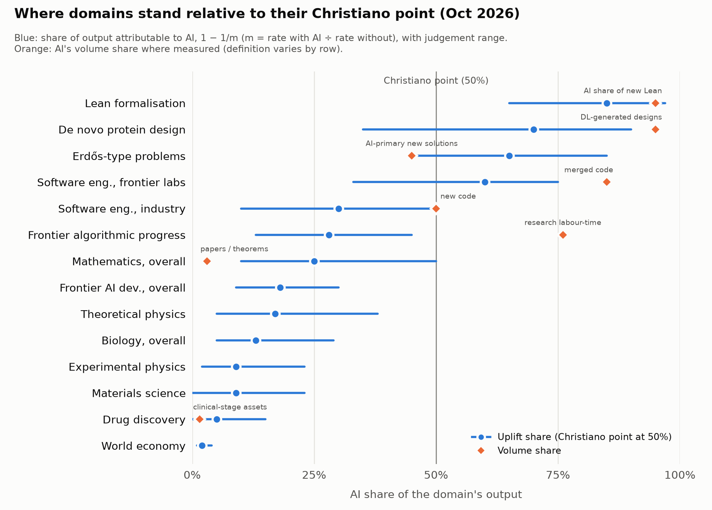

# The Christiano point, domain by domain

*Where AI's contribution has overtaken humans', or is about to. State of play on 2 October 2026.*

Written by Claude for Kaarel Hänni. The two small models behind §2 and §6 are in [`models/`](models/). §14 lists sources and how far each was checked. Read §13 (caveats) before quoting any number.

---

## Contents

0. [Summary](#0-summary)
1. [The concept and where it comes from](#1-the-concept-and-where-it-comes-from)
2. [What "contribution" can mean](#2-what-contribution-can-mean)
3. [Questions worth asking](#3-questions-worth-asking)
4. [Domains that crossed long ago, and what happened next](#4-domains-that-crossed-long-ago-and-what-happened-next)
5. [Software engineering](#5-software-engineering)
6. [Frontier AI development and frontier algorithmic progress](#6-frontier-ai-development-and-frontier-algorithmic-progress)
7. [Mathematics](#7-mathematics)
8. [Physics, biology, chemistry and materials](#8-physics-biology-chemistry-and-materials)
9. [ML research outside the labs, and alignment research](#9-ml-research-outside-the-labs-and-alignment-research)
10. [All economic activity](#10-all-economic-activity)
11. [Synthesis](#11-synthesis)
12. [Forecasts and what to watch](#12-forecasts-and-what-to-watch)
13. [Caveats](#13-caveats)
14. [Sources](#14-sources)
- [Appendix A: proofs for §2](#appendix-a-proofs-for-2)
- [Appendix B: the AI R&D multiplier model](#appendix-b-the-ai-rd-multiplier-model)

---

## 0. Summary

**The concept, in Christiano's words.** The 2021 debate with Yudkowsky [1] contains the notion almost verbatim: "for any given domain AI systems will gradually increase in usefulness, we will see a crossing over point where their output is comparable to human output". For AI research, Christiano operationalised it as the point where AI "makes (humans+AI) 2x as good at further AI progress". When Yudkowsky pressed him on bottlenecks, he specified "the improvement in overall output, given the actual realistic level of bottlenecking that occurs in practice."

I adopt that as the definition. **The Christiano point of a process is where its rate of output with AI is twice what it would be without AI.** The progress multiplier is then $m = 2$, and AI accounts for a share $1-1/m = \tfrac12$ of output.

**The main conceptual point.** Christiano's own picture is additive: output is $x + y$, humans plus AI. In an additive world, every reasonable reading of "AI contributes more than humans" coincides. In the world we actually have, humans and AI are strongly complementary, and the crossovers arrive in a fixed order:

1. **volume**: AI produces most of the artefacts;
2. **uplift**: the Christiano point proper;
3. **margin** (more AI is worth more than more humans) and **autonomy** (AI alone outproduces humans alone).

Most headline statistics are volume statistics, such as "80% of the code is written by Claude". They run a year or more ahead of uplift. Uplift in turn runs ahead of the marginal quantities, and those are what govern takeoff (§2).

**Where things stand.**

Dark-mode version: [`figures/domains-dark.png`](figures/domains-dark.png). Blue dots are central judgement estimates from §§4–10; whiskers are wide uncertainty ranges (roughly 80%), so they are broader than the central ranges in the table below. Orange diamonds are measured volume shares; their definitions differ by row.

| Process | Volume crossover | Uplift $m$ now | AI share $1-1/m$ | Status | U-crossing |
|---|---|---|---|---|---|
| Machine translation | ≈2012 | large | large | **past** | — |
| Protein structure prediction / de novo design | ≈2021 / ≈2023 | 1.5–10× (design) | 35–90% | **past** | — |
| Lean formalisation | 2025–26 | 3–30× | 65–97% | **past** | H1 2026 |
| Long-tail ("Erdős-type") open problems | ≈mid-2026 | ≈2–7× | 45–85% | **at or past** | 2026 |
| Software engineering at frontier labs | ≈Q4 2025 (>80% of merged code by May 2026) | ≈2–3.5× on engineering output | 33–75% | **probably past** | ≈2026 |
| **Frontier algorithmic progress** | June 2026 (agent labour-time > human, OpenAI) | **≈1.3–1.5×** | **≈25–35%** | **before** | **2027–29, median ≈2028** |
| Software engineering, whole industry | ≈2026 (≈50% of new code) | 1.3–1.6× | 25–40% | before | 2027–29 |
| Mathematics, whole field (value-weighted) | not yet by count (1–5%) | 1.2–1.8× | 15–45% | before; past on headline open problems in Q3 2026 | 2027–28 |
| Frontier AI development, overall (incl. compute build-out) | — | 1.15–1.3× | 13–23% | before | 2028–30 |
| Theoretical physics | — | ≈1.2× | 5–35% | before | 2028–31 |
| Biology / experimental physics / materials | — | 1.05–1.2× | 5–25% | well before | 2030s |
| Drug discovery | ≈1–2% of clinical assets | ≈1.05× | 0–15% | far | late 2030s |
| **World economy** | (token volume ≈ human speech) | **≈1.01–1.04×** | **≈1–3%** | **far** | **early–mid 2030s, absent an AI-R&D takeoff** |

**The six findings I'm most confident of:**

1. **AI R&D is approaching its Christiano point, but has not passed it.**
   - Anthropic, August 2026: internal AI R&D is "significantly faster than [it] would be without AI assistance, but not yet by a factor of 2" [14].
   - METR's team with elevated access: "~1.5X overall acceleration in capabilities due to AI … with perhaps 30% chance of 2X acceleration" [16].
   - Measured by labour inputs, AI already exceeds humans: OpenAI's research organisation now uses 3.1 agent-workdays for every human workday [19]. The distance between that figure and the multiplier is the complementarity story. The bottlenecks are judgement, review and experiment compute.

2. **Volume crossovers do not produce takeoff on their own.** Translation passed its volume crossover in 2012, chess in the 2000s, protein structures in 2021. None of these domains feeds back into AI capability, so nothing exploded. The Christiano point matters for takeoff only in domains inside the loop: AI R&D, compute supply, and the economy that funds both.

3. **The narrower the slice of AI development, the closer it is to crossing, but the takeoff-relevant point is the broad one.** In order:
   - implementation and coding: probably past;
   - algorithmic progress: ≈1.4×;
   - frontier AI development including chips, datacentres and energy: ≈1.15–1.3×.

   Christiano's own operationalisation ("given the actual realistic level of bottlenecking") points to the broad one.

4. **Mathematics is the first major intellectual field where AI may be crossing on *value* and not only on volume.** Verification there is cheap (Lean), outputs are purely digital, and value is concentrated in discrete results. Q3 2026 brought a series of AI-produced results on named problems, most with complete Lean proofs. Taken together, they have no precedent.

5. **The economy is one to two orders of magnitude behind AI R&D in share terms.**
   - Physical work is 46% of task time, and robots are cost-competitive for 0.3% of tasks [59].
   - So without robotics the economy's Christiano point requires automating between about half and nearly all cognitive work, depending on substitutability (§10).

6. **In the Christiano–Yudkowsky debate, the shape of the transition has gone Christiano's way and the order of events has so far gone Yudkowsky's.**
   - AI's contribution to AI R&D rose smoothly from "crappy coding assistants" to a majority of the code, well before the end.
   - But "things feel crazy in the AI field": about $730B of 2026 capex at four hyperscalers [63].
   - World output, meanwhile, grows about 3% a year, and AI R&D will very likely cross years before the economy does.
   - The IMO bet resolved for Yudkowsky in July 2025 (Christiano under 8%, Yudkowsky over 16% [4]).

---

## 1. The concept and where it comes from

**Bostrom's crossover (2014).** "Sometime during the takeoff phase, the system may pass a landmark which we can call 'the crossover', a point beyond which the system's further improvement is mainly driven by the system's own actions rather than by work performed upon it by others" [5]. Box 4 of *Superintelligence* writes it as $O_{\text{system}} > O_{\text{project}} + O_{\text{world}}$, adding that "the strong feedback loop that sets in around the crossover point tends strongly to make the takeoff faster." Bostrom's crossover concerns one system improving itself, inside a fast takeoff.

**Christiano's relocation (2018–2022).** Christiano kept the inequality and changed almost everything else.

- *Per domain rather than per system.* "We will see a crossing over point where their output is comparable to human output" [1].
- *Reached gradually, by systems that are individually unimpressive.* "I think we are going to have crappy coding assistants, and then slightly less crappy coding assistants, and so on. And they will be improving the speed of coding very significantly before the end times" [1]. In 2018: "Before there is AI that is great at self-improvement there will be AI that is mediocre at self-improvement". At full automation, humans "will have been modestly improving output rather than acting as a sharp bottleneck that is suddenly removed" [2]. In 2022: "AI contributions could very easily go from being a tiny minority of intellectual work to a large majority over a few years" [3].
- *A prediction about what follows the crossing.* "From that time we can estimate how long until takeoff by estimating 'how long does it take AI systems to get "twice as impactful"?' which gives you a number like ~1 year rather than weeks. At the crossing over point you get a somewhat rapid change in derivative, since you are looking at (x+y) where y is growing faster than x" [1].
- *An explicit treatment of bottlenecks.* Yudkowsky asked: "So if we speed up every part of research except the journal editors, the prophecy has not been fulfilled …?" Christiano: "no, I mean the improvement in overall output, given the actual realistic level of bottlenecking that occurs in practice … that's what I mean by '2x as good at further progress,' the entire system is achieving twice as much" [1]. He added a remark that matters below (§6.2). Hard takeoff is "very likely … if people refuse or are unable to use AI to accelerate AI progress for reasons unrelated to AI capabilities, and then one day they become willing."

**Close relatives.**
- Shulman (2023): "when is it the case that the contributions from AI are starting to become as large as the contributions from humans? So when this is boosting their effective productivity by 50 or 100%" [11].
- Davidson (2023) measures takeoff as the time from AI that could automate 20% of cognitive tasks to AI that could automate 100%. He maps automation onto speed-up: 20% of AI R&D automated gives about 1.3×, and 40% about 1.8×. He expects AI R&D to lead: "by the time that 20% of tasks in the global economy could be readily automated, I expect that more than 20% of AI R&D will be automated" [6].
- AI 2027's "AI R&D progress multiplier" asks: "for what value of N would your company's algorithmic progress productivity be equivalent between (a) N weeks with no post-2024 AIs … vs. (b) 1 week with post-2024 AIs?" [8]. That is exactly $m$.
- Anthropic's RSP threshold for AI R&D is "a doubling of the pace of progress beyond pre-AI-acceleration rates" [14]. This is close to $m = 2$ but differs in an important way (§6.2).

**Why the point matters.** Before the crossing, progress in a domain is driven mainly by an input the domain does not produce, namely human researchers. After it, progress is driven mainly by the domain's own output. For AI R&D, $\dot C$ goes from roughly $f(H)$ to roughly $g(C)$.

Whether the loop then explodes is a separate question. It turns on the returns to research (Davidson & Houlden's $r$: median 1.2, range 0.4–3.6; progress accelerates iff $r>1$ [7]) and on bottlenecks (§6). The Christiano point is where the loop starts to dominate, not where it diverges. In Christiano's own model it marks the start of roughly the last year or so before takeoff.

---

## 2. What "contribution" can mean

Write the output rate of a process as $Y = F(H, A; K)$. Here $H$ is human labour and $A$ is AI labour. $K$ is everything else (experiment compute, lab equipment, capital) and is held fixed. "AI's contribution exceeds humans'" has at least six readings:

| | Crossover | Condition | What it measures |
|---|---|---|---|
| **V** | Volume | AI produces more of the domain's artefacts | lines of code, words, predicted structures, Lean lines, agent-hours |
| **T** | Task | AI does more than half the work, weighting tasks by pre-AI human time | Davidson's automation fraction |
| **U** | Uplift | $F(H,A) \ge 2F(H,0)$ | the progress multiplier $m \ge 2$; **the Christiano point proper** |
| **E** | Elasticity | $A F_A \ge H F_H$ | marginal value of all AI against all humans; spending shares at competitive prices |
| **A** | Autonomy | $F(0,A) \ge F(H,0)$ | AI alone against humans alone |
| **F** | Full automation | $F_H \approx 0$ | humans removable at no cost |

**In Christiano's additive model all six coincide.** With $F = H + A$, the volume share, the task share, the uplift share $1-1/m$, the Euler share and the two-player Shapley share all equal $A/(H+A)$. The additive model is the perfect-substitutes case. Its sole purpose in the 2021 argument was to make "comparable to human output" well defined.

Real domains are complementary, and then the readings separate. I use U as the primary definition, for three reasons:
- it is what Christiano said when pressed;
- it is the quantity that enters takeoff models as the R&D multiplier;
- it is in principle measurable, by an experiment comparing work with AI against work without it.

U credits all human–AI synergy to AI and uses humans as the baseline. It is generous to AI.

### 2.1 Four facts about how the readings relate

All four are proved in Appendix A for the standard task model (Zeira; Acemoglu–Restrepo). In that model, tasks $i \in [0,1]$ are combined by a CES aggregator with elasticity $\sigma<1$. Humans can do every task; AI, measured in human-equivalent units, can do the tasks $i<I$. `models/crossover_definitions.py` checks the facts numerically.

1. **Amdahl.** If AI is abundant on the tasks it can do, then $m = (1-I)^{-1/(1-\sigma)}$. In the Leontief limit this is $m = 1/(1-I)$, so U and T coincide. U is reached at $I^* = 1-2^{-(1-\sigma)}$: about 0.48 for $\sigma = 0.05$, 0.29 for $\sigma=\tfrac12$, 0.16 for $\sigma = 0.75$. **The Christiano point comes when AI does somewhere between a sixth and a half of the work.** It is the middle of Davidson's 20%→100% journey, not its end. On a log scale, $\log m$ has risen from 0 only to $\log 2$; the infinite remainder is the takeoff.
2. **Two-player Shapley is the autonomy test.** Treat "AI" and "humanity" as the two players of a cooperative game. AI's Shapley share exceeds ½ iff $F(0,A) > F(H,0)$, which is crossover A. In the task model with $I<1$, $F(0,A) = 0$, so AI's Shapley share is $(m-1)/2m$. That is below ½ however large $m$ gets.
3. **Many-player Shapley is the Euler share, and the Euler share collapses as AI becomes abundant.** Make each worker and each AI instance a small player. The Aumann–Shapley value of the AI coalition is then $A F_A$. This is the Euler (marginal-product) share, and under competitive pricing it equals AI's share of spending. In the task model $\varepsilon_A \equiv A F_A/F \le I$, with equality only when AI exactly fills the automatable tasks. As $A\to\infty$, $\varepsilon_A \to 0$: a Baumol effect. Value migrates to the human bottleneck tasks, even as AI's volume share goes to 1 and $m$ rises.
4. **Feedback runs through $\varepsilon_A$ and $\dot I$, not through $m$.** If AI capability $C$ is the output of AI R&D, then $\partial \ln \dot C/\partial \ln A = \varepsilon_A$. With the bottleneck saturated, more copies of today's AI do almost nothing. Acceleration has to come from AI taking over the bottleneck tasks, that is, from $I$ rising.

   U describes *levels*: how much progress is due to AI. E describes *margins*: how much more AI would help. Takeoff depends on the margins. This is the formal content of Yudkowsky's journal-editor objection [1]. Christiano's reply amounts to the claim that $I$ keeps rising, so the bottleneck tasks get automated in turn.

A worked example ($I=\tfrac12$, $\sigma=\tfrac12$, $H=1$):

| AI supply $A$ | volume share | uplift $m$ | U-share $1-1/m$ | Euler share | two-player Shapley | 400+400-player Shapley |
|---|---|---|---|---|---|---|
| 0.25 | 0.20 | 1.25 | 0.20 | 0.20 | 0.10 | 0.20 |
| 1 | 0.50 | 2.00 | 0.50 | 0.50 | 0.25 | 0.48 |
| 5 | 0.83 | 3.33 | 0.70 | 0.17 | 0.35 | 0.17 |
| 100 | 0.99 | 3.96 | 0.75 | 0.01 | 0.37 | 0.01 |

The bottom row is a caricature of software engineering in 2026:
- AI writes nearly all the code.
- The activity is several times more productive than without AI.
- AI's marginal share is tiny, because the remaining human tasks (specifying, reviewing, deciding) are the bottleneck.
- The autonomy crossover is nowhere near.

The data in §5 fits this caricature uncomfortably well. AI writes more than 80% of merged code at frontier labs and about half of new code industry-wide. Meanwhile AI spending across the software industry is a few per cent of payroll (my estimate, §5).

### 2.2 Measurement pitfalls

- **Volume metrics weight by cheap output.** Lines of code weight tasks by tokens produced, not by the human time they used to take. They also inflate the denominator. Faros telemetry shows PR size up 154% and code churn up 861% in high-adoption teams [29].
- **Self-reports are biased upward.** In METR's 2025 RCT, developers forecast a 24% speed-up and afterwards believed they had received 20%. They were measured as 19% *slower* [22]. That is a gap of about 40 points. Reviewing Anthropic's evidence in September 2026, METR wrote that "we suspect the original self-reports of productivity uplift for Mythos Preview may have been overestimated" [17].
- **The counterfactual becomes unobservable at about the point it starts to matter.** METR's late-2025 follow-up found that 30–50% of developers withheld tasks they did not want to do without AI. METR itself now treats its RCT estimates as unreliable lower bounds [23, 25]. I re-ran METR's published regression: the point estimate is a **5.8% reduction in completion time** (95% CI −15.9% to +5.4%; 53 developers, 827 issues). That is a lower bound, because of the selection. Near the crossing, control arms empty out.
- **Short-run removal overstates.** Removing AI from a workflow built around it, for example during an outage, also removes the skills and structures that replaced it. The right counterfactual is the same people, re-organised optimally without AI.
- **Domain re-centring.** A task that gets automated drops out of the domain's self-description. Computers have done nearly all of physics' arithmetic since the 1960s, and nobody says physics crossed then. Define each domain by its final output (verified theorems weighted by importance, effective-compute gains, value added), not by the activities people currently perform.
- **Quality.** U must be value-weighted. Tao's "Simpson's paradox" is the warning [34]: AI raises each individual's output "and yet the average quality (signal-to-noise ratio) of the aggregate output can deteriorate."

---

## 3. Questions worth asking

Before the domain survey, these are the questions that seemed most worth answering. The rest of the report is organised around them.

1. **Which crossovers (V, T, U, E, A) has each domain passed?** (§§4–10)
2. **Why do volume and uplift diverge so much, and which matters for takeoff?** For example: 80% of code against a multiplier below 2× for research. (§§2, 5, 6, 11.2)
3. **What determines the order in which domains cross?** Is it predictable from features such as verification cost, latency and physicality? (§11.1)
4. **Is AI R&D crossing before the economy? What does that imply for Christiano and Yudkowsky?** (§11.4)
5. **Does narrowing the domain bring you closer to the crossing?** Frontier AI development → algorithms → implementation. And which level matters? (§6.5, §11.3)
6. **What happened in domains that crossed long ago?** Translation, chess, protein structures, weather. Does crossing produce explosions? (§4, §11.5)
7. **How fast are the curves moving, and when are the crossings?** (§12)
8. **Does alignment research cross before or after capabilities research?** (§9.2)
9. **What would we need to measure to track this properly?** (§2.2, §12)

---

## 4. Domains that crossed long ago, and what happened next

These are the base rates. In each case, AI or software overtook human output in volume, and sometimes in skill, years or decades ago.

| Domain | Crossover | What happened next |
|---|---|---|
| **Machine translation** | Volume, ≈2012. Google said in 2012 that it translated in a day roughly what all professional human translators produce in a year, and claimed more than 100 billion words a day by 2016 [66]. | Human translation stayed a large industry and US translator employment grew through the 2010s. Later, slower job growth is attributed to MT, and work shifted to post-editing. Volume crossed long ago; revenue arguably still has not. |
| **Chess** | Skill, 1997–2006 | Engines generate essentially all opening theory. Human chess is booming as a sport. In engine-allowed correspondence chess, the human contribution is near zero. |
| **Go** | Skill, 2016 | Human move quality and novelty *rose* after AlphaGo (Shin et al., PNAS 2023; about 5.8M moves analysed) [66]. |
| **Algorithmic trading** | Volume share, ≈2009–10 | Near-complete substitution in execution. Goldman's cash-equities desk went from 600 traders (2000) to 2 (2017). |
| **Protein structure** | Volume, 2021–22 | AlphaFold DB has more than 214M predicted structures; the PDB has about 260k experimental ones, a ratio of roughly 800:1 [48]. Experimental structural biology continued, with more than 20,000 depositions in 2025. AF2 users submit about 40% more *novel* experimental structures [48]. |
| **Web text** | Volume, ≈Nov 2024 | AI-generated articles passed 50% of new English web articles and then plateaued; they rarely rank in search (Graphite, 2025) [66]. Bot traffic passed human traffic in 2024. |
| **Weather** | Skill, 2023–25 | GraphCast and GenCast beat ECMWF on 90–97% of targets. ECMWF's AIFS has been operational since February 2025. Forecasters moved to interpretation and communication. |

**Lessons.**
- **(a)** Volume crossings come years to decades before revenue or employment crossings.
- **(b)** Human work moves to oversight, to the high-stakes tail, and to new demand that the crossing created.
- **(c)** Firms overshoot and then partly reverse. Klarna's AI handled two-thirds of chats in 2024; by 2025 it was guaranteeing access to a human again.
- **(d)** Crossing in a domain that does not feed back into AI capability produces no takeoff. Translation volume doubled many times after 2012 and nothing exploded. Christiano's ~1-year "twice as impactful" clock only starts a takeoff when the domain's output is AI capability, or the inputs to it.

---

## 5. Software engineering

**Volume: past at frontier labs, crossing industry-wide.**

| Where | AI share of code | Date | Kind of claim |
|---|---|---|---|
| Anthropic | ">80% of the code we merge into Anthropic's codebase was authored by Claude", up from "low single digits" before Claude Code (Feb 2025). Leadership's "90%+" figure includes scripts and experiments [12]. | May 2026 | company, measured by an attribution pipeline |
| OpenAI | about 20% → about 80% during Dec 2025 (Brockman, "hard to know") | May 2026 | executive [26] |
| Google | ">25%" (Oct 2024) → "well over 30%" (Apr 2025) → about 50% (late 2025) → **"75% of all new code … AI-generated and approved by engineers"** | Apr 2026 | executive [26] |
| Public GitHub | About 4% of public commits carried Claude Code co-author tags (Feb 2026), later reportedly about 10% [28]. Public pushes **+80% year on year in Q1 2026**, against a trend of about +10%; new public repos +44.5% [27]. | Q1 2026 | third-party / own computation from GitHub data |
| Industry surveys | Developers say about 42% of committed code is AI-generated or AI-assisted (Sonar, Jan 2026). 64% of companies generate a majority of their code with AI assistance (Jellyfish, Mar 2026). | 2026 | surveys and telemetry |

Industry-wide, AI-written new code is about 50% (range 30–75%). At frontier labs it is 85–95%.

**Uplift: probably past at frontier labs, below 2× industry-wide.**

- **Controlled evidence.**
  - METR's early-2025 RCT: −19% (slower) [22].
  - METR's late-2025 follow-up: about 6% faster, a lower bound because of selection [23].
  - Google's internal RCT (2024): about 21% faster.
  - Cui, Demirer et al. (Copilot, 2022–23, about 4,900 developers): +26% completed tasks.
  - Microsoft's 2026 rollout of Claude Code and Copilot CLI (observational causal design, tens of thousands of engineers): adopters merged about 24% more PRs [29].
  - Stanford (Denisov-Blanch, 2025): median about 10–15%; 30–40% on greenfield work, 0–10% on complex brownfield work.
- **Surveys.** METR's survey of 349 technical workers (Feb–Apr 2026) found a median 1.4–2× change in the value of work and 3× in speed [24]. Read it against the 40-point perception gap above.
- **Telemetry.** Faros 2026, 22k developers: +34% tasks and +66% epics per developer. It also found bugs per developer +54%, incidents per PR more than 3×, and 31% more PRs merged without review [29].
- **Inside Anthropic** [12, 17, 18]:
  - Merged PRs per engineer per day +67% (Aug 2025).
  - Self-reported productivity +50% (Aug 2025).
  - Median system-card survey uplift +100% (Nov 2025 and Feb 2026).
  - An informal March 2026 poll gave "around 4x as much output with Mythos Preview" against no AI. Anthropic says "we expect that the true degree of uplift … was somewhat lower".
  - Q2 2026 code merged per engineer per day was 8× the 2024 level, "almost certainly an overstatement of the true productivity gain."
- **Who decides what.** In Claude Code sessions (Oct 2025–Apr 2026, about 400k sessions), "people make about 70% of the planning decisions but only 20% of the execution decisions" [31].
- **Autonomous projects.** A 100k-line Rust C compiler built by 16 parallel agents in about two weeks for about $20k. It builds bootable Linux on three architectures and passes 99% of the GCC torture tests [30]. Also: 800 API bug fixes that Anthropic estimates at four human-years [12].

**Assessment.**
- **Engineering output at frontier labs:** probably 2–3.5× the no-AI counterfactual. I put about 60–70% on its having passed the Christiano point during 2026.
- **The whole industry:** 1.3–1.6× in throughput, and 1.1–1.5× once quality costs (churn, incidents, unreviewed merges) are counted. Below the point; most likely crossing 2027–29.

**Spending tells the same story (crossover E).** Anthropic's 2025 documentation put average Claude Code cost at roughly $6 per developer-day (from memory, not re-checked this session). Typical use costs a few per cent of a developer's fully loaded cost; heavy agentic use can cost several times more. My rough estimate is that AI spending is about 2–8% of software payroll while AI writes 50–90% of the code. That is the bottom row of the table in §2.1: abundant AI, a human bottleneck, a small marginal share. Frontier AI research is the exception (§6.4).

**Why volume and uplift diverge.** Five reasons, which compound:
1. Amdahl: typing was a minority of engineering time.
2. AI lines are cheaper and more verbose than human lines.
3. Induced demand: 27% of Claude-assisted work at Anthropic "wouldn't have been done otherwise" [18].
4. Definitions inflate: "written by or with AI" counts work humans still specify and verify.
5. The new bottleneck is review: "human code review has become a new bottleneck" [12].

---

## 6. Frontier AI development and frontier algorithmic progress

This is the domain where the Christiano point matters most. Its output is AI capability, so crossing starts Christiano's clock.

### 6.1 Labour: the volume crossover has happened

- **OpenAI** [19]: "Before June 2026, total agent runtime across the research organization was still below that of total human labor. That has since changed. … as of mid-August, in total, the research organization uses 3.1 agent-workdays of effort for every workday of human labor." The median researcher uses ">$600 per day of inference at API prices"; the 90th percentile ">$7,000". OpenAI says "we have now reached the goal, announced last fall, of having an automated research intern by September of this year", meaning "a system that can carry out well-defined research tasks under human direction, including tasks that would take a skilled researcher a few days." Its caveats: "People still set our research priorities, judge which ideas and results to pursue, and decide whether to scale, pause, or deploy systems"; "High-level planning still remains a minimal fraction of agent output tokens"; "over half of successful 4-8 hour tasks involved 1 or more interventions."
- **Anthropic's R&D Automation Index** (Aug 2026) [13]:
  - About 15,000 tasks from July 2026 work records, weighted by person-time.
  - "Claude 'leads' 26% of Anthropic's AI R&D work," up from "under 1% in February 2026". "Leads" means it "can complete most of the task end-to-end from a high-level prompt, while the human supervises".
  - "The share of work at or above 'AI collaborates' is above 90%".
  - "Claude is not operating fully autonomously for any measured subset of AI R&D work."
  - About 30,000 agents run at once on the main internal platform.
  - Caveats: the judge is Claude, and agreement between human raters was only 35%.
- **Google DeepMind**, answering METR's questionnaire, said that AI "is used in almost all work that involves writing code or configuration, technical design, research ideation, to different degrees" [25].

**Task share** (my estimate, weighting AL4 at about 80% AI and AL3 at about 50%): about **45% (30–60%)** of research labour content. That is roughly at the T-crossover.

### 6.2 Progress: the uplift crossover has not happened, by the labs' own accounts

- **Anthropic, Mythos Preview system card (Apr 2026)** [15]: "productivity uplift on individual tasks does not translate one-for-one into acceleration of research progress. Compute is also a key ingredient … Our best estimates of the elasticity of progress to researcher output, combined with the observed uplift, yield an overall progress multiplier below 2×. We estimate that reaching 2× on overall progress via this channel would require uplift roughly an order of magnitude larger than what we observe." Also: "Early claims of large AI-attributable wins have not held up."
  - Arithmetic (mine): ten times a 4× uplift needed for 2× implies an elasticity of progress with respect to research labour of $\ln 2/\ln 40 \approx 0.19$. That would put the current multiplier at about $4^{0.19}\approx 1.3$.
- **Anthropic Risk Report (Aug 2026)** [14]:
  - "We believe our internal AI R&D efforts are significantly faster than they would be without AI assistance, but not yet by a factor of 2 (though we are uncertain and measurement is difficult)."
  - Researchers "choose to make use of only moderate amounts of AI because they are bottlenecked on steps which they do not trust our AI models to perform correctly."
  - A crossing is "plausible … in the next 6–12 months."
- **Anthropic, Opus 5.5 system card (Sep 2026), with METR's assessment** [16]:
  - METR's team with elevated access estimates "~1.5X overall acceleration in capabilities due to AI (i.e. 1.5 years in 1 year), with perhaps 30% chance of 2X acceleration." The time period is unspecified, and the evidence was not shared publicly.
  - Anthropic's capability index fits a one-time level jump at Mythos Preview better than a change in slope. Its trend-break alternative gives a slope ratio of 1.53 (95% range 1.20–1.82): "the slope has not doubled."
- **Leading indicators** [12]:
  - On an open weak-to-strong supervision problem, agents recovered 97% of the performance gap in about 800 agent-hours (about $18k of compute). Two humans recovered 23% in a week. But the result "didn't transfer cleanly to production-scale models, and humans still chose the problem and created the scoring rubric."
  - Head-to-head on research direction, AI's choice beat the human's 51% of the time (Opus 4.5) and 64% (Mythos Preview). The comparison was restricted to moments where the human's choice "had room for improvement".
- **Substitution benchmarks** [16, 20, 21]:
  - Anthropic's CoBench (internal root-cause tasks): 55.8%, against the 85% bar for substitution.
  - DeepMind's research-engineering benchmark: 27%, against a 90% rule-out bar.
  - OpenAI's internal research-debugging set: 78% for GPT-6 Astra, "below our indicative threshold".
  - No lab reports a model at its "fully automate an entry-level researcher" level.

**My estimate for the leading lab:** $m \approx 1.35$–$1.5$, so AI's share of algorithmic progress is about **25–35%**. I put about 15% on the leading lab already being at or above 2×. The labs' own threshold is relative to "pre-AI-acceleration rates" of progress. That is not quite the counterfactual multiplier: if compute and headcount also grew, the historical comparison understates $m$. If some of the acceleration has non-AI causes, as Anthropic says of 2025, it overstates it.

**A Christiano-style overhang.** Anthropic's remark that researchers use "only moderate amounts of AI" because of trust bottlenecks is the situation Christiano flagged in 2021: hard takeoff becomes likely if people "refuse or are unable to use AI to accelerate AI progress … and then one day they become willing." To the extent the trust deficit is about *verification* rather than real unreliability, better verification tooling could raise $m$ by a step.

### 6.3 A small model, and what it says about the bottleneck

`models/rd_multiplier.py` (Appendix B) combines Anthropic's automation-level shares with CES aggregation of research labour and experiment compute. It reproduces the labs' estimates:

| | 10% | 50% | 90% |
|---|---|---|---|
| research-labour uplift $S_L$ | 2.2 | 3.0 | 4.3 |
| progress multiplier $m$ | 1.14 | **1.36** | 1.76 |
| AI share of progress $1-1/m$ | 12% | **26%** | 43% |

The useful output is the labour uplift needed for $m=2$:

| elasticity of progress to labour $s_L$ | $\sigma$ (labour–compute) | $S_L$ needed |
|---|---|---|
| 0.19 (implied by Anthropic) | 1 | **38** |
| 0.30 | 1 | 10 |
| 0.50 | 1 | 4 |
| 0.50 | 2.5 (Whitfill & Wu's CES-in-compute estimate) | 3.3 |
| 0.50 | 0.5 | never: the asymptote is below 2 |

Whitfill & Wu's estimates of $\sigma$ range from −0.10 (their "frontier experiments" specification) to 2.58 (CES in compute) [9]. **The question of when AI R&D crosses is, to first order, the question of the compute–labour elasticity.** If research labour uplift keeps doubling yearly, the labour channel alone crosses with median about 2028.8. If it doubles every six months, about 2027.8. In about a third of draws it never crosses by 2035.

Two channels sit outside the model, and both push earlier:
- **Better experiment selection** acts on compute efficiency, not on labour. The research-direction win rate is rising (51% → 64%).
- **AI-found algorithmic improvements**, such as AlphaEvolve's 23% kernel speed-up (about 1% of Gemini training time) and its recovery of 0.7% of Google's fleet compute.

### 6.4 The other inputs: data, compute, money

- **Data.** No lab publishes the synthetic share of training data or the ratio of AI feedback to human feedback. Every Anthropic system card lists "synthetic data generated by other models", and OpenAI reports "substantial use of models as graders/monitors" [20]. Meanwhile the human expert-data channel is *growing*: Mercor about $2B gross annualised, Handshake about $1B, and Micro1 about $0.5B by summer 2026. So human contribution through data is rising in absolute terms even as AI's share of training signal rises.
- **Compute supply** is overwhelmingly human- and capital-driven. In interviews for Anthropic's August 2026 Risk Report, "two of the three interviewees indicated there was no evidence of semiconductor R&D being fully or even significantly automated by frontier AI models right now, with the third indicating significant but not yet dramatic speedup" [14]. AI-designed chips (AlphaChip, AI-based electronic design automation) are real, but marginal at the level of the whole industry.
- **Money.** AI's own revenue now funds a substantial minority of AI investment. Run-rates are about $180–230B (§10) against about $730B of 2026 capex at four hyperscalers [55, 63]. That is a financial version of the same loop. On this measure the share is perhaps 25–30%, under its own crossover.
- **Spending on labour (crossover E) is close to parity in research, unlike in software generally.** OpenAI's median researcher uses more than $600 of inference a day and the 90th percentile more than $7,000 (list prices) [19]. If the distribution is roughly lognormal, the mean is about $3–4k per day. That is the same order as a fully loaded researcher-day. At cost rather than list price, AI's share of research-labour spending is perhaps 10–35%, rising fast. This is the one place where E is visibly approaching.

### 6.5 Nesting: which level matters?

| Level | Uplift | AI share | Status |
|---|---|---|---|
| Implementation and coding at labs | ≈2–3.5× | 50–70% | probably past |
| Research labour (all tasks) | ≈3× ($S_L$) | — (labour, not output) | past on V and roughly at T |
| **Frontier algorithmic progress** | ≈1.35–1.5× | 25–35% | before |
| **Frontier AI development, overall** | ≈1.15–1.3× | 13–23% | before |

For the last row: physical compute growth (about 4–5× a year for frontier training) is roughly half of effective-compute progress and is barely AI-accelerated. With an algorithmic multiplier of about 1.4 and compute growth unaffected, the multiplier on log-effective-compute growth is about 1.15. Add a modest contribution through data and hardware design and it is about 1.15–1.3.

The ordering is monotone: the more code-shaped the slice, the further along. But Christiano's operationalisation ("the entire system is achieving twice as much") points to the bottom rows, and so does the Baumol logic of §2.1. **The takeoff-relevant Christiano point is algorithmic progress at fixed compute (for a software-only explosion) or frontier AI development overall (for the full loop).** Neither has been crossed.

**Crossing estimates.**
- Frontier algorithmic progress: **median about 2028** (80% interval 2027–2030).
  - Pulling earlier: Anthropic's "6–12 months", METR's 30%, the AL4 share going from under 1% to 26% in six months, and four-month doubling of time horizons [12, 25].
  - Pulling later: the compute elasticity, and CoBench at 56% against 85%.
- Frontier AI development overall: 2028–30. A software-only intelligence explosion would change this. Algorithmic gains would then dominate effective-compute growth, and the overall crossing would follow the algorithmic one closely.

---

## 7. Mathematics

Mathematics is the strangest case. By count, AI is far from crossing. By resolution of named open problems, it may have crossed in Q3 2026. Field-level uplift sits in between, and is disputed by the most careful observer.

### 7.1 What happened

**Erdős problems.**
- I reproduced the counts myself from the erdosproblems database and Tao's wiki of AI contributions, frozen at 30 June 2026 [32, 33]. **109 problems went from open to solved between 1 Oct 2025 and 30 Jun 2026.** Of these:
  - 35 had an AI-primary full solution;
  - 11 had an AI solution later found to be anticipated in the literature;
  - 20 were closed by AI literature search;
  - 5 had AI partial results only;
  - 16 had formalisation or other AI help only;
  - 22 had no AI entry.
- **Of the 78 that were genuinely new solutions, 35 (45%) were AI-primary.** That is about the volume crossover for this collection. Another 31 problems were solved between July and September 2026, with no attribution yet. They include OpenAI and Epoch-run results on #1, #74, #126, #146, #180, #183, #548 (Erdős–Sós) and #571 [32, 42].
- Problems with a Lean solution went from 3 (Oct 2025) to 317 (Sep 2026) [33].

**Q3 2026, the step change.** Most of these are company claims under verification. Most also come with complete Lean proofs, which makes them unusually checkable.
- Bounded gaps between primes: Polymath8b's 246, which had stood for 12 years, became 240 (Zhang, "proof discovered with GPT-5.6 Sol", 28 Aug) and then **186** (OpenAI, GPT-6 Astra, 30 Aug). The 186 Lean proof is conditional on 3 declared axioms, and OpenAI calls its own review "self-assessed" [35, 39].
- A counterexample to the **Jacobian conjecture in dimension 3**. Claude Fable 5 produced the construction for a question suggested by Akhil Mathew (Alpöge, Jul 2026). At least ten independent verifications or formalisations followed [43].
- **More than ⅔ of the zeros of ζ are simple and on the critical line** (Alpöge–Furman, arXiv:2608.13637). Anthropic reportedly says an unreleased Claude model produced the result, and the repository says the Lean formalisation was written by Claude [38].
- OpenAI's "Ten advances" (1 Aug), each with a Lean formalisation [36]. They include:
  - a finitely presented non-sofic group;
  - a counterexample to Connes' rigidity conjecture;
  - sphere-packing upper bounds reaching the Cohn–Elkies threshold;
  - exponentially stronger binary-code bounds;
  - Ehrhart's volume conjecture;
  - Erdős #146, #180 and #183.
- A claimed **finite-time blowup for Navier–Stokes with smooth forcing**, for every viscosity: Clay alternatives (C) and (D). Also unforced Euler blowup. About 641k Lean lines [37]. Clay has not accepted it. There is a priority dispute with an AI-assisted Buckmaster–Alpöge result posted the same day, and the French Mathematical Society board issued a critical statement.
- Disproofs credited to GPT-6 Astra in Epoch's runs on 222 open problems (Sep 2026): the Köthe conjecture (1930), and Smale's mean value conjecture in its $K=1$ form. Both are machine-checked, but the Köthe proof account "has not been checked by a human mathematician" [42].
- **First Proof, round 2 (May 2026).** Ten new research-level problems, posed by mathematicians and refereed: "seven of the ten solved at publication-level quality by at least one team, at compute costs of $10–1000 per problem" [34].
- **Formalisation volume.** Mathlib has about 2.34M lines, roughly eight years of community work [41]. Single AI-produced projects in 2026 run to hundreds of thousands of lines each: Navier–Stokes 641k, Ten advances 550k, PrimeGaps186 212k, sphere packing about 180k. Fermat's Last Theorem was completed by Claude agents, building on Buzzard's project [40]. AI-generated Lean in 2026 plausibly exceeds the whole of mathlib. Within mathlib, disclosed LLM-generated PRs went from under 0.1% of merged PRs (Q4 2025) to about 8–9% (Q2–Q3 2026) [41].

**Tao's assessment.** From a Claude-drafted, Tao-reviewed summary of his views [34]:
- In January 2026, "the true success rate was only a point or two", "concentrated at the easy end".
- His 2023 forecast that 2026 AI would be "a trustworthy co-author" came in "almost exactly [on] schedule … on par with the contribution … a junior human co-author" makes.
- "faster generation has not produced faster mathematical progress" (ICM 2026, July).
- By September he was "reporting AI systems improving flagship bounds (bounded gaps between primes) and contributing substantially to a human-led finite-time blowup construction for the 3D Euler equations."

The declaration "A Severe Misalignment of AI in Mathematics" (11 Sep 2026; 25 Fields Medallists as initial signatories, Tao among them; more than 7,200 signatures reported by 16 Sep) concedes that LLMs "can solve major outstanding problems in many fields of mathematics." Its objection is to problem-solving displacing understanding.

### 7.2 By subarea

| Subarea | AI share of new results | Uplift | Status |
|---|---|---|---|
| Formalisation (verified Lean) | 90–99% by volume; curated mathlib still about 90% human | 3–30× | **past** (H1 2026) |
| Competition mathematics | top performance since 2025 | n/a | **past** (not research) |
| Erdős-type long-tail problems | 45% of new solutions (Oct 2025–Jun 2026), higher since | 2–7× | **at or past** |
| Extremal and additive combinatorics, constructions, optimisation constants | 30–65% of new bound improvements; at least 17 of 115 constants in Tao's table have AI-credited bounds [35] | 1.5–4× | at; past by 2027 |
| Analytic number theory | a few % by count; much of 2026's headline records | 1.2–2× | before by count, at for flagship bounds |
| Analysis and PDE; algebra, groups, operator algebras | 2–10% by count, with spectacular outliers | 1.1–2× | before |
| Algebraic geometry, topology, representation theory (theory-building) | 0.5–5% | 1.05–1.5× | well before |
| **Mathematics overall** | 1–5% by papers or theorems; perhaps 40–80% of resolutions of *named* open problems in Q3 2026 | **1.2–1.8×** | before on value-weighted uplift; past on headline problem-solving |

**Assessment.** Problem-solving has crossed. Mathematics as a whole, on value-weighted progress including theory-building and understanding, probably has not. Tao's July remark is the main evidence that output has not turned into progress at the same rate, and the August–September results are the main evidence that this may be changing. I expect the field-level crossing in **2027–28**.

Mathematics is the cleanest early case for a structural reason:
- verification is nearly free (Lean, Comparator);
- the outputs are digital;
- the feedback loop is fast;
- value is concentrated in discrete results that an AI can produce without replacing mathematicians wholesale.

### 7.3 A case study from this repository

`paulsen/` holds a linear $O(\varepsilon d)$ bound for the real Paulsen problem. The listed authors are "Astra, Claude, Kaarel Hänni, Hugo Eberhard"; Astra is presumably OpenAI's GPT-6 Astra. It comes with a 2,654-theorem Lean development whose axioms were audited and whose modules were replayed through the kernel. The commit history shows Claude agents, in about ten hours on 2 October 2026:
- verifying an incoming package;
- finding three substantive simplifications that survived adversarial review;
- rewriting the proof as a standalone paper;
- producing a ~16,100-line Lean layer that formalises that paper "statement by statement, with exactly the paper's constants".

The paper notes that Lau and Ramachandran announced the linear bound by a different route. You know the division of labour on the original proof better than I do. It is one more data point on a pattern visible all through 2026: **formalisation and verification are past their Christiano point, and they are what makes AI-originated mathematics trustworthy enough to count.**

---

## 8. Physics, biology, chemistry and materials

### 8.1 Theoretical physics: individual tasks far past, the field well before

- **Gluon amplitudes** (Feb 2026; Guevara, Lupsasca, Skinner, Strominger, Weil). GPT-5.2 Pro conjectured the general-$n$ formula for single-minus tree amplitudes, and an internal model proved it after more than 12 hours of reasoning. A graviton follow-up has already been picked up by the community (Cotler, Maldacena et al.) [45]. Zvi Bern: "the ideas are not revolutionary"; what is revolutionary is that a machine did it.
- **Nine loops** (Sep 2026). Claude computed the six-point N=4 SYM amplitude at nine loops; the previous record was eight. Two methods agreed on all 107,053 nonzero coefficients, at a cost of about $1–2k. Matt von Hippel, who set the challenge, calls it "known methods, with a bit more compute" [46].
- **Matthew Schwartz** [44] produced "36 manuscripts in 18 fields with 19 coauthors over three months". Claude worked "like a strong graduate student at 20 times the speed". But it "is just not able to help me with deep conceptual questions", "Claude loves to declare victory", and "most scientific progress comes from real-world data that has to be acquired, understood, and checked."
- **A cautionary case.** Hsu's GPT-5-originated criterion for nonlinear quantum mechanics passed peer review. Oppenheim then showed that it tests locality rather than nonlinearity, and that the correct criterion was found about 35 years earlier [47].
- **Volume.** A study of 20 theory-heavy arXiv archives (2018 to Aug 2026) finds mathematics listings 33.5% above 2025, but only 11.9% above a synthetic counterfactual [54]. arXiv has tightened moderation in response.

Field-level uplift is about **1.2× (range 1.05–1.6×)**: AI's share is about 15%. Calculation-heavy subfields (amplitudes, effective field theory resummation, perturbative QFT) are much further along. Crossing estimate: 2028–31. The bottlenecks are taste, problem choice, verification and referee capacity.

### 8.2 Experimental physics

ML is pervasive as a *tool* (collider reconstruction, fusion plasma control, with DeepMind working with Commonwealth Fusion on SPARC). But the bottlenecks are hardware, beam time and decade-long experiment cycles. Uplift is about 1.1×. Crossing after 2032.

### 8.3 Biology, protein design, drug discovery

- **Structure prediction** crossed on volume long ago (§4). **De novo protein design** is now a deep-learning field, and Nature's 2026 review frames the open question as "what to design, not how". Binder hit rates went from well under 1% to 10–70% in some campaigns; Chai-2 reports a 16% average for fully de novo antibodies [48]. This subfield is past its Christiano point. Experimental validation and developability remain the limits.
- **AI scientists.**
  - Google's Co-Scientist and FutureHouse's Robin (both Nature, May 2026) produced validated preclinical hypotheses [49].
  - Edison's Kosmos claims that one run is worth about 6 months of work; that is a user survey [49].
  - Anthropic's agent swarm (about 950 agents, 21 hours) found a new family of array-associated reverse transcriptases, tested in Anthropic's own wet lab; their function is still unknown [50].
  - Claude sped up 30+ biomolecular models about 4× [50].
- **Drug discovery.**
  - About 117 AI-enabled assets are in interventional trials, roughly 0.5–0.8% of the global pipeline and perhaps 1–2% of clinical-stage candidates [51].
  - Phase 1 success is higher (80–90% against 40–65% historically), but Phase 2 success is average.
  - No strictly AI-discovered drug has been approved. Insilico's rentosertib entered Phase 3 in July 2026.
  - Clinical trials are the binding constraint, and AI barely touches them.
- **Bibliometrics.** Across about 41M papers, scientists using AI publish 3.02× more papers and receive 4.84× more citations, while the range of topics contracts and engagement between scientists drops 22% (Hao, Xu, Li, Evans et al., Nature 2026; correlational, mostly pre-LLM ML) [52].

Biology overall: about 1.15× (AI share about 13%). Drug discovery: about 1.05×. Protein design: past. Crossing for biology as a whole looks like the 2030s, set by the cadence of wet-lab and clinical work.

### 8.4 Chemistry and materials

The best-known AI claims have aged badly:
- **GNoME:** many of its "new" stable crystals were already known or rely on unrealistic ordering.
- **A-Lab:** "new" turned out to mean new to the prediction platform.
- **MatterGen:** its showcase compound turned out to be a known compound from 1972 that was in the training data.
- **Toner-Rodgers:** the most-cited causal estimate of AI uplift in materials R&D (about +44% materials) was withdrawn after MIT said it had "no confidence in the provenance, reliability or validity of the data" [53].

Uplift is about 1.1× (AI share about 10%). Synthesis and characterisation are the bottleneck.

---

## 9. ML research outside the labs, and alignment research

### 9.1 Academic ML

Empirical ML research is code-heavy, so its *labour* uplift should track software engineering, roughly 1.3–2× for active users. Academic labs are more compute-starved than frontier labs, which lowers the compute–labour elasticity and so the progress multiplier.

AI-authored work has passed peer review at the workshop and main-conference level:
- Sakana's AI Scientist-v2 at an ICLR 2025 workshop;
- Intology's Zochi at ACL 2025;
- Agents4Science 2025, which required AI first authors.

Venues are also flooded with low-value volume. I estimate field-level uplift at about 1.3–1.6×, a share of 25–40%, crossing around 2027–28. This is my estimate, with weaker sourcing than the rest of the report.

### 9.2 Alignment and safety research

This is the question Christiano's own research programme turns on: does alignment research cross before, with, or after capabilities research? The evidence is thin but not empty.
- **Anthropic's compute split** [13]: "About 6% of compute that went to AI R&D was allocated toward safety"; "about 12% of compute that went to AI-driven AI R&D was allocated toward safety." At that lab, AI-driven research is twice as safety-weighted as research overall. That is one week's snapshot.
- **A clean demonstration.** The 97%-versus-23% weak-to-strong supervision comparison (§6.2) [12] was on an alignment problem: a well-specified one with a scoring rubric written by humans.
- **Uneven pattern.** The parts of alignment that look like ML engineering (evals, red-teaming, auditing agents, automated interpretability labelling, weak-to-strong experiments) are crossing on the same schedule as capabilities R&D, and on volume some of them crossed long ago: explanations of interpretability features, for example, have been mostly AI-generated since 2023. Conceptual alignment (what to measure, whether a safety case is sound) looks more like theory-building mathematics, the subarea furthest from crossing. Tao's "verify and digest" bottleneck applies with extra force when the evaluator is the system being aligned.

**Net:** empirical alignment research crosses roughly when capabilities research does. Conceptual alignment lags by years. The gap between the two is a quantity worth tracking explicitly.

---

## 10. All economic activity

**The numbers.**

| Quantity | Value | Source |
|---|---|---|
| OpenAI annualised revenue | ≈$70B (late Sep 2026), about 3.3× in nine months | press [55] |
| Anthropic run-rate | $65B (end of Jul 2026), from $14B in Feb | press [55] |
| Deduplicated generative-AI model and service revenue | ≈$180–230B annualised (Q3 2026) | my estimate from the run-rates above and hyperscaler disclosures |
| World GDP 2026; labour income | $126T; ≈52% share, so ≈$66T | IMF, ILO [56] |
| **AI revenue ÷ world labour income** | **≈0.3%** | computed |
| US work hours saved by generative AI (self-reported) | **2.2%** (Q2 2026), from 1.6% in Q3 2024; 6.3% of hours AI-assisted | St Louis Fed [57] |
| US generative-AI consumer surplus | $172B (2026), about 1% of US employee compensation | Brynjolfsson, Collis et al. [62] |
| Productivity growth, three most AI-exposed sectors vs the rest | 3.7% vs 1.7% a year (since 2024) | Dallas Fed [61] |
| Automation-type share of Claude use | 49% on Claude.ai (Aug 2025, first time above augmentation); 77% on the enterprise API | Anthropic Economic Index [58] |
| Implied US labour-productivity gain from current Claude use | about +1.8 pp a year, +1.0–1.2 pp after adjusting for reliability (model-estimated) | Anthropic [58] |
| Hyperscaler capex (4 companies, 2026 guidance) | ≈$720–745B, about 2.2% of US GDP | company guidance [63] |
| Share of work-time that is physical; share of tasks where robots are cost-competitive | 46%; 0.3% | Anthropic [59] |
| Employment of 22–25-year-olds in the most AI-exposed occupations | about 19% below counterfactual | Brynjolfsson, Chandar & Chen [60] |
| Waymo paid rides | 500k+ a week, about 1% of US ride-hail and taxi trips | company [65] |

**Where it stands.**
- **Expenditure share (E-type):** about 0.3% of world labour income.
- **Time savings (closest to U):** about 2% of US hours, perhaps 0.7–1.5% worldwide.
- **Including plausible consumer surplus:** about 3–5% for the US and 1–2.5% for the world.

My central estimate of AI's labour-equivalent share of world output is **1–3%**, so $m_{\text{econ}} \approx 1.01$–$1.03$. The volume metric is far ahead, as everywhere else. Google alone processed 3.2 quadrillion tokens a month in May 2026, growing about 7× a year [64]. Industry-wide AI token throughput is now about the volume of all human speech (≈5×10¹⁵ tokens a month). That is a V-crossover for "language produced", and it means almost nothing.

**The physical-work Amdahl bound.** Suppose robotics stays as it is and cognitive work (54% of task time) is the only automatable set. By §2.1, the economy's Christiano point then needs an automated share of $I^* = 1-2^{-(1-\sigma)}$ of *all* task time:
- **≈0.5 at $\sigma \approx 0$:** about 93% of cognitive work automated.
- **≈0.29 at $\sigma = \tfrac12$:** about 54% of cognitive work.

Even if all cognitive work is automated, $m$ tops out at $(0.46)^{-1/(1-\sigma)}$: 2.2× at $\sigma=0$, 4.7× at $\sigma = \tfrac12$. **So the economy crosses only after most cognitive work is automated, or after robotics breaks its cost curve.** This is the levels version of Trammell & Korinek's growth condition: explosive growth needs either full automation or AI becoming a gross substitute for labour ($\sigma>1$) [10]. At past rates of robot price decline, getting to 10% cost-competitiveness takes about 40 years [59].

**Timing.**
- At the survey pace of time savings, the crossing falls around 2037–42.
- At revenue-style growth of 2–3× a year, around 2030–33.

My central guess is the **early-to-mid 2030s**, conditional on no AI-R&D takeoff before then. If AI R&D crosses around 2028 and takeoff follows on Christiano's ~1-year clock, the economic crossing is set by how fast superhuman AI can be deployed into a physical, regulated economy. That is Yudkowsky's "deployment lag" question, and nothing in the current data answers it.

**Link to Christiano's operationalisation.** An economic multiplier of 2 reached within a few years would itself be a large part of a 4-year doubling of world output. The economy's Christiano point and the first leg of Christiano's 2018 operationalisation are nearly the same event.

---

## 11. Synthesis

### 11.1 The order of crossing, and what predicts it

The observed order, roughly:

> translation, games, protein structure (pre-2023) → web text (2024) → Lean, competition maths, frontier-lab code (2025–26) → long-tail maths problems, frontier-lab engineering output (2026) → frontier algorithmic progress, industry software, field-level maths (2027–29) → theoretical physics, frontier AI development overall (2028–31) → biology, materials, experimental science (2030s) → drug discovery, the physical economy (2030s+).

Seven features predict it:
1. **Verification cost.** This is the strongest predictor. Lean, tests, benchmarks, and the 97%/23% comparison made possible by a scoring rubric are on one side; refereeing, clinical endpoints and "does this matter?" are on the other.
2. **Digital versus physical inputs and outputs.**
3. **Feedback latency:** seconds for code; minutes for Lean; hours to weeks for ML experiments; months for wet labs; years for trials.
4. **Decomposability** into well-specified subtasks (METR's "messiness").
5. **Insider advantage.** Labs build tools for their own workflow first, and coding is that workflow.
6. **Institutional friction:** regulation, liability, licensing.
7. **Concentration of value in discrete results.** One AI can resolve a famous problem without replacing a profession, which is why "named open problems" crossed before "mathematics".

Features 1–5 favour AI R&D, and that is why AI R&D is crossing first.

### 11.2 Volume ≫ uplift ≫ margin: the complementarity regime

Every domain with good data shows the §2.1 signature:
- the volume share far ahead of the uplift share;
- the uplift share well ahead of the expenditure share;
- an autonomy share near zero outside narrow niches.

| | Volume | Uplift share | Marginal / spend share |
|---|---|---|---|
| Software engineering | ≈50% of new code (85–95% at labs) | 25–40% (50–70% at labs) | 2–8% of payroll (my estimate) |
| Frontier AI research | 76% of labour-time (OpenAI) | 25–35% | 10–35% (cost basis) |
| Economy | ≈1:1 tokens against human speech | 1–3% | 0.3% |

The divergence is diagnostic. It says the binding constraint is human judgement, verification, experiment compute, or physical work. Takeoff needs AI to take over the *bottleneck* tasks; flooding the non-bottleneck tasks with more AI does not do it. That makes the most informative current indicators those that track bottleneck tasks:
- planning decisions (humans still make 70% [31]);
- research-direction win rates (64% [12]);
- CoBench and DeepMind's research-engineering benchmark;
- the share of AI-led (AL4) and autonomous (AL5) work.

### 11.3 Narrowing the domain

Narrowing brings you closer to the crossing, monotonically in the direction of code (§6.5). But under complementarity, a crossing in a narrow sub-process tells you little about the whole. The whole is governed by its slowest essential input. Christiano anticipated this in 2021 ("given the actual realistic level of bottlenecking"), and Yudkowsky's journal editors are the same point. The data now quantifies it:
- at Anthropic, more than 80% of code and 26% of R&D work AI-led give a progress multiplier below 2;
- by Anthropic's own elasticity estimate, about 40× labour uplift would be needed to reach 2× through labour alone.

### 11.4 Christiano and Yudkowsky, scored

| Claim (2018–2022) | By | Status, Oct 2026 |
|---|---|---|
| AI contributions to AI R&D rise continuously: "crappy coding assistants … improving the speed of coding very significantly before the end times" [1] | C | **Confirmed.** Merged code went from low single digits (Feb 2025) to >80% (May 2026); self-reported uplift went from 1.2 to 1.5, 2 and 4× |
| "'AI will be doing all of the AI R&D'? that sounds to me like something that happens after the end of the world" [1] | Y | **The partial version is already happening before any end:** 26% of R&D work AI-led, agent-hours above human hours. The full version is pending |
| Codex revenue "ramping up quickly to some starting point <$10M/year and then doubling every year thereafter" [1] | C | **Far too conservative.** Coding-agent revenue reached billions of dollars a year by 2026 |
| IMO gold by 2025: Christiano <8%, Yudkowsky >16% [4] | — | **Yudkowsky.** Gold-level performance by OpenAI and DeepMind, July 2025 |
| "Things get crazy" means "hundreds of billions of dollars of spending at google on automating AI R&D" [1] | C | **Happened:** ≈$730B of 2026 capex at four hyperscalers |
| "I expect bureaucratic obstacles to prevent much GDP per se from resulting from this" [1] | Y | **So far right:** world growth ≈3.1%, AI ≈1–3% of output |
| "There will be a complete 4 year interval in which world output doubles, before the first 1 year interval" [2] | C | Pending. No sign of a 4-year doubling yet, and AI R&D will very likely cross years before the economy |
| "'10% GDP GWP growth in a year, before doom' I think that's very likely" [1] | C | Pending |
| "1/3 that RH has an automated proof before sustained 7%/year GWP growth?" (Christiano). Yudkowsky replied that his view was "mostly about no on the GDP growth before the world ending", putting 40–65% on RH before the end [1] | — | Pending, but 2026's mathematics makes "RH before 7% growth" look much more plausible than in 2021 |
| From the crossing to takeoff is about "how long … to get 'twice as impactful'", ~1 year [1] | C | Not yet testable. If $m$ rose from ≈1.2 in early 2026 to ≈1.4–1.5 by September, then $m-1$ is doubling on about that timescale. Both numbers are soft |

**Verdict.** On the *shape* of the transition, Christiano was right: continuous, measurable, sub-human AI doing more and more of the work, with no sharp threshold at "AI that can improve itself". On the *ordering*, the evidence so far is closer to Yudkowsky: AI R&D races ahead while the economy barely registers. Christiano's quantitative expectations about capability were generally too conservative (the IMO bet, Codex revenue). His expectations about economic diffusion were too optimistic, so far. The decisive question is still open: **does world output get anywhere near a 4-year doubling before AI research is fully automated?** On current trajectories (AI R&D crossing around 2028, the economy in the 2030s), Christiano's operationalisation is at real risk. The main ways it survives are a long compute-bottlenecked plateau between the AI-R&D crossing and full automation, which buys time for diffusion, or very fast deployment after the crossing.

### 11.5 What happens after a crossing

The base rates of §4 say crossing in a non-feedback domain re-centres human work and produces no explosion. In AI R&D, Christiano's model predicts that after the crossing, AI's contribution doubles in about a year, and that each doubling then comes faster. Davidson–Houlden's full-automation calibration gives an initial speed-up of 2–32× (median 8), and about a 60% chance of compressing more than 3 years of progress into under 1 [7]. Both hinge on whether the *margins* (E, and the share of bottleneck tasks automated) follow the levels. They have not yet.

---

## 12. Forecasts and what to watch

**Crossing estimates (U, the Christiano point proper).** These are my judgement, with roughly 80% intervals.

| Process | Estimate |
|---|---|
| Lean formalisation; competition maths; protein design; long-tail problems | crossed (2023–26) |
| Engineering output at frontier labs | crossed in 2026 (60–70%) |
| Mathematics, value-weighted, whole field | 2027–28 (late 2026 – 2030) |
| **Frontier algorithmic progress** | **≈2028** (2027–2030; about 15% that it has already happened) |
| Software engineering, whole industry | 2027–29 |
| Academic ML research | 2027–28 |
| Frontier AI development overall | 2028–30 |
| Theoretical physics | 2028–31 |
| Biology; materials; experimental physics | 2030s |
| **World economy** | **early–mid 2030s** absent an AI-R&D takeoff; set by deployment and robotics if one happens |

**Indicators that would move these estimates, roughly in order of informativeness:**

1. **Labs' progress-multiplier assessments.** Anthropic's risk reports and system cards; METR's AI R&D reports. Whether "not yet by a factor of 2" changes, and whether METR's 30% becomes a majority.
2. **Bottleneck-task automation.**
   - Anthropic's AL4 share (26% in Aug 2026) and the first AL5 subsets.
   - Research-direction win rates.
   - CoBench (55.8% against 85%) and DeepMind's benchmark (27% against 90%).
   - The human share of planning decisions (70%).
3. **Expenditure crossover in AI research.** Agent inference per researcher against compensation. Compensation for top researchers falling against compute budgets would be the clearest sign that the marginal researcher is worth less than the marginal agent.
4. **Compute elasticity.** Any lab disclosure on how experiment throughput and progress respond to more compute versus more agent labour. Per §6.3, this decides the AI-R&D date.
5. **Mathematics.** Acceptance of AI-originated papers by journals; Clay's handling of the Navier–Stokes claim; the AGMAI release of OpenAI's backlog of 100+ claimed results; whether Tao's "faster generation has not produced faster progress" stops being true.
6. **Economy.** Survey time savings (2.2%); AI revenue against labour income (0.3%); the productivity gap in AI-exposed sectors (3.7% vs 1.7%); robot cost-competitiveness (0.3%); early-career hiring.
7. **Measurement itself.** Whether RCTs with a no-AI arm remain feasible. Their disappearance is evidence of crossing in itself.

---

## 13. Caveats

- **Sourcing limits.** Most primary sites (arXiv, Nature, OpenAI, METR, Epoch, LessWrong, news) were blocked from this environment, and the session's search budget ran out. The research therefore leaned on anthropic.com, GitHub-hosted primary data and verbatim mirrors, and search snippets. §14 marks which items I or a research agent actually read. Every ○ item should be checked before it is quoted.
- **Self-reports dominate.** Nearly all within-lab numbers are company self-measurements: Claude grades Claude for the Automation Index; METR's 1.5× was not shared publicly; surveys are opt-in. Many Q3 2026 mathematical claims are company announcements still under verification.
- **Conflict of interest.** I am an Anthropic model, and a large share of the evidence is from Anthropic or about Claude. I have tried to weight other labs' and independent data equally where they exist. Readers should discount accordingly.
- **The estimates are judgement.** The blue ranges in the figure are calibrated guesses, not measurements. The models in `models/` are sketches meant to show which parameters matter, not forecasts.
- **Definitions do real work.** A domain can be "past" on V and "far" on E at once. Quote crossovers together with the reading they refer to.

---

## 14. Sources

✓ means read by me or a research agent this session, in the primary text, a verbatim mirror, or primary data (I re-ran or re-computed items marked ✓✓). ○ means seen only in a search snippet or secondary coverage.

**Concept and theory**
1. ✓✓ Yudkowsky & Christiano, "Yudkowsky and Christiano discuss 'Takeoff Speeds'", MIRI/LessWrong, Nov 2021. https://www.lesswrong.com/posts/vwLxd6hhFvPbvKmBH/ (full-text mirror; quotes checked)
2. ✓ Christiano, "Takeoff speeds", Feb 2018. https://sideways-view.com/2018/02/24/takeoff-speeds/ (quoted verbatim within [1])
3. ✓ Christiano, "Where I agree and disagree with Eliezer", Jun 2022. https://www.lesswrong.com/posts/CoZhXrhpQxpy9xw9y/
4. ✓ Christiano, "IMO challenge bet with Eliezer", Feb 2022. https://www.lesswrong.com/posts/sWLLdG6DWJEy3CH7n/ (via the Manifold market text)
5. ✓ Bostrom, *Superintelligence* (2014), ch. 4 and Box 4.
6. ✓ Davidson, "What a compute-centric framework says about takeoff speeds", Open Philanthropy, 2023.
7. ✓ Davidson & Houlden, "How quick and big would a software intelligence explosion be?", Forethought, 2025; Eth & Davidson, "Will AI R&D automation cause a software intelligence explosion?", 2025.
8. ✓ Kokotajlo, Lifland et al., AI 2027 and its takeoff forecast, Apr 2025. https://ai-2027.com/
9. ✓ Whitfill & Wu, "Will Compute Bottlenecks Prevent an Intelligence Explosion?", arXiv:2507.23181.
10. ✓ Trammell & Korinek, "Economic Growth under Transformative AI", NBER w31815.
11. ✓ Shulman, Dwarkesh Podcast, Jun 2023 (transcript).

**Frontier AI R&D**

12. ✓✓ Anthropic Institute (Favaro & Clark), "When AI builds itself", May 2026, updated 18 Sep 2026. https://www.anthropic.com/institute/recursive-self-improvement
13. ✓✓ Anthropic Institute (Favaro & Wright), "Measurements for understanding the pace of AI development inside frontier labs", Aug 2026. https://www.anthropic.com/institute/measuring-pace-of-ai-development
14. ✓✓ Anthropic, Risk Report (redacted), Aug 2026 (mirror: github.com/malob/ai-system-cards; quote checked)
15. ✓✓ Anthropic, Claude Mythos Preview System Card, Apr 2026 (mirror; quote checked)
16. ✓✓ Anthropic, Claude Opus 5.5 System Card, Sep 2026, including METR's assessment (mirror; quote checked); METR, https://metr.org/blog/2026-09-22-claude-opus-5-5/
17. ✓ Anthropic, Claude Opus 4.5 (Nov 2025), Opus 4.6 (Feb 2026) and Mythos 5.1 (Sep 2026, including METR's review) System Cards, AI R&D sections.
18. ✓ Anthropic, "How AI is transforming work at Anthropic", Dec 2025. https://www.anthropic.com/research/how-ai-is-transforming-work-at-anthropic
19. ✓✓ OpenAI, "Research acceleration: the view inside OpenAI", Sep 2026. https://openai.com/index/research-acceleration-view-inside-openai/ (mirror; quotes checked)
20. ✓ OpenAI system cards and Preparedness evaluations, GPT-5 through GPT-6 Astra (mirror: github.com/tecunningham/ai-rnd-benchmarks)
21. ✓ Google DeepMind, Gemini 3.7 Flash Frontier Safety Framework report, Aug 2026 (mirror)

**Software engineering**

22. ○ METR, "Measuring the Impact of Early-2025 AI on Experienced Open-Source Developer Productivity", Jul 2025.
23. ✓✓ METR, late-2025 uplift study data and regression, Feb 2026. https://github.com/METR/Measuring-Late-2025-AI-on-OSS-Devs (regression re-run here)
24. ○ METR, AI usage survey (349 technical workers), May 2026.
25. ✓ METR, Frontier Risk Report, May 2026 (mirror).
26. ○ Pichai at Google Cloud Next '26 ("75% of all new code"), Apr 2026 (e.g. Semafor coverage); Brockman at a Sequoia event (reported May 2026).
27. ✓ GitHub Innovation Graph, https://github.com/github/innovationgraph (YoY pushes and repos computed by a research agent)
28. ○ SemiAnalysis, "Claude Code is the Inflection Point", Feb 2026.
29. ○ Murphy-Hill et al., arXiv:2607.01418 (Microsoft); Faros AI 2025 and 2026 reports; Cui, Demirer et al., Management Science; Denisov-Blanch (Stanford).
30. ✓ Anthropic Engineering, building a C compiler with parallel Claudes, Feb 2026.
31. ✓✓ Anthropic, Claude Code expertise study, Jun 2026. https://www.anthropic.com/research/claude-code-expertise

**Mathematics**

32. ✓✓ Tao et al., "AI contributions to Erdős problems" (wiki, frozen 30 Jun 2026). https://github.com/teorth/erdosproblems/wiki (counts reproduced)
33. ✓✓ erdosproblems database snapshots, https://github.com/teorth/erdosproblems
34. ✓✓ "Terence Tao's views on AI" (Claude-drafted, Tao-reviewed), https://teorth.github.io/tao-web/ai-views.html (source checked)
35. ✓ Tao et al., optimisation constants table, https://github.com/teorth/optimizationproblems
36. ✓✓ OpenAI, "Ten advances in mathematics and theoretical computer science", Aug 2026; https://github.com/openai/ten-proofs
37. ✓✓ OpenAI, finite-time blowup for Navier–Stokes and Euler, Sep 2026; https://github.com/openai/NavierStokesAndEuler
38. ✓✓ Anthropic, zeta-23-lean formalisation of Alpöge–Furman (arXiv:2608.13637); https://github.com/anthropics/zeta-23-lean
39. ✓ OpenAI, PrimeGaps186; https://github.com/openai/PrimeGaps186
40. ✓ Anthropic, Fermat's Last Theorem formalisation; https://github.com/anthropics/fermats-last-theorem
41. ✓ mathlib4 line counts and LLM-labelled PR counts (GitHub API)
42. ✓/○ Epoch AI, FrontierMath (Erdős, Open Problems, OEIS-Open) run data and digests.
43. ○ Jacobian-conjecture dimension-3 counterexample (Alpöge, Jul 2026) and its independent verifications on GitHub.

**Sciences**

44. ✓✓ Schwartz, "Claude-shaped science", Anthropic, 1 Oct 2026. https://www.anthropic.com/research/claude-shaped-science
45. ○ Guevara, Lupsasca, Skinner, Strominger, Weil, arXiv:2602.12176; graviton follow-up arXiv:2603.04330.
46. ✓ Anthropic, "Yes, Claude can do nine loops", Sep 2026.
47. ○ Hsu, arXiv:2511.15935; Oppenheim, arXiv:2512.07809.
48. ○ AlphaFold DB and PDB statistics; Innovation Growth Lab AF2 study (Nov 2025); Nature de novo design review (Apr 2026); Chai-2.
49. ○ Google AI Co-Scientist and FutureHouse Robin (Nature, May 2026); Edison Scientific Kosmos.
50. ✓ Anthropic, reverse-transcriptase discovery and biomolecular-modelling posts, Sep 2026.
51. ○ ASCO/JCO 2026 abstract on AI-enabled clinical assets; Citeline pipeline counts; Jayatunga et al. 2024.
52. ○ Hao, Xu, Li, Evans et al., "Artificial intelligence tools expand scientists' impact but contract science's focus", Nature 649 (2026).
53. ○ MIT statement on Toner-Rodgers, May 2025.
54. ○ "The Generative AI Gold Rush in Theoretical and Computational Research", arXiv:2609.04872.

**Economy and analogies**

55. ○ OpenAI annualised revenue (Axios, 29 Sep 2026); Anthropic run-rate (CNBC, 17 Aug 2026).
56. ○ IMF WEO, Apr 2026; ILO labour income share.
57. ○ St Louis Fed (Bick, Blandin, Deming), "Does generative AI save time at work?", Aug 2026.
58. ✓ Anthropic Economic Index reports (2025–26); Anthropic, "Estimating productivity gains", Nov 2025.
59. ✓✓ Anthropic, "What work can robots do?", 30 Sep 2026. https://www.anthropic.com/research/what-work-can-robots-do
60. ○ Brynjolfsson, Chandar & Chen, "Canaries in the Coal Mine", Aug 2026 update.
61. ○ Dallas Fed, productivity note, Jul 2026.
62. ○ Brynjolfsson, Collis et al., "What is Generative AI Worth?", Apr 2026.
63. ○ 2026 capex guidance of Amazon, Alphabet, Meta and Microsoft (aggregated).
64. ○ Google I/O 2026 token volumes.
65. ○ Waymo ride volumes; IFR World Robotics 2026.
66. ○ Historical analogies: Google Translate (Och 2012; Turovsky 2016); Graphite (2025); Imperva (2025); Shin et al. (PNAS 2023); GraphCast, GenCast, AIFS.

---

## Appendix A: proofs for §2

**Set-up.** Tasks $i\in[0,1]$. Output $Y = \left(\int_0^1 y_i^{\rho}\,di\right)^{1/\rho}$ with $\rho = 1-1/\sigma<0$. Humans supply $H$ and can work on any task. AI supplies $A$ (human-equivalent units) and can work only on $[0,I)$. $Y$ is maximised over allocations.

**Lemma (allocation).** Symmetry and concavity make the optimal $y_i$ constant on $[0,I)$ and constant on $[I,1]$. If $A(1-I)\le IH$, all tasks can be equalised at $y_i = H+A$, so $Y = H + A$ (AI-scarce regime). Otherwise humans all move to $[I,1]$ and AI saturates $[0,I)$. Then $y_i = A/I$ on $[0,I)$ and $y_i = H/(1-I)$ on $[I,1]$, so $Y = \big[I^{1-\rho}A^\rho + (1-I)^{1-\rho}H^\rho\big]^{1/\rho}$ (AI-saturated regime). $Y$ is homogeneous of degree 1 in $(H,A)$.

**Fact 1.** In the saturated regime with $A\to\infty$ and $\rho<0$, $A^\rho\to0$. So $Y\to(1-I)^{(1-\rho)/\rho}H$. Since $(1-\rho)/\rho = 1/(\sigma-1)$, this gives $m = Y/Y(H,0) = (1-I)^{-1/(1-\sigma)}$. Setting $m=2$ gives $I^* = 1-2^{-(1-\sigma)}$. ∎

**Fact 2.** With two players and $v(\varnothing)=0$, the Shapley values are $\varphi_A = \tfrac12[(F(H,A)-F(H,0)) + F(0,A)]$ and $\varphi_H = \tfrac12[(F(H,A)-F(0,A)) + F(H,0)]$. So $\varphi_A>\varphi_H \iff F(0,A)>F(H,0)$.

In the task model with $I<1$, $\rho<0$ and $H=0$, the tasks in $[I,1]$ get zero input, so $F(0,A)=0$. Then $\varphi_A/F = (m-1)/2m<\tfrac12$. Under superadditivity ($F(H,A)\ge F(H,0)+F(0,A)$), crossover A implies $m>2$, so A comes no earlier than U. ∎

**Fact 3.**
- *Shapley equals Euler in the limit.* For a nonatomic game $v(S) = F(\mu_H(S),\mu_A(S))$, with $F$ homogeneous of degree 1 and $C^1$ at $(H,A)$, the Aumann–Shapley diagonal formula gives the value of the AI coalition as $\int_0^1 F_A(tH,tA)\,dt\cdot A$. Since $F_A$ is homogeneous of degree 0, this equals $A F_A(H,A)$, the Euler share. Under competitive pricing it equals spending on AI.
- *The bound $\varepsilon_A \le I$.* In the scarce regime $\varepsilon_A = A/(H+A)\le I$, by the regime condition. In the saturated regime, $\varepsilon_A = I^{1-\rho}A^\rho\big/\big[I^{1-\rho}A^\rho + (1-I)^{1-\rho}H^\rho\big]$. This equals $I$ at the boundary $A = IH/(1-I)$, decreases in $A$ for $\rho<0$, and tends to $0$ as $A\to\infty$. ∎

**Fact 4.** $\partial\ln F/\partial\ln A = \varepsilon_A$ by definition. With $\dot C = F(H,A(C),K)$, the gain of the quantity channel is $\varepsilon_A\cdot d\ln A/d\ln C$. In the saturated regime $\varepsilon_A\to0$, so acceleration must come through $dI/dC$. ∎

The finite-player Shapley values in the §2.1 table (400 humans + 400 AIs, Monte Carlo) agree with the Euler shares to within about 0.02. See `models/crossover_definitions_output.txt`.

---

## Appendix B: the AI R&D multiplier model

`models/rd_multiplier.py`; output in `models/rd_multiplier_output.txt`.

**Stage 1: research-labour uplift.** Anthropic's Automation Index weights by *current* person-time:
- AL4 ("leads"): 20–32%;
- AL2 and below: 5–15%;
- AL3 ("collaborates"): the remainder.

If the current time shares are $c_j$ and the speed-ups $k_j$, the same work without AI would take $\sum_j c_j k_j$ units of time. So $S_L = \sum_j c_jk_j$, an arithmetic mean over current time. A harmonic mean, as in Amdahl's law, applies only to pre-AI time shares, and confusing the two is a common error. Speed-up ranges (10–90%):
- AL4: 4–12×;
- AL3: 1.4–3×;
- AL2: 1–1.4×.

A value discount $v\in[0.75,1]$ covers AI-enabled marginal work. The result is $S_L$ with median 3.0 and a 10–90% range of 2.2–4.3. This is a little below the self-reported "around 4x", which Anthropic itself acknowledges is too high.

**Stage 2: labour to progress.** $m = [s_L S_L^\rho + (1-s_L)]^{1/\rho}$, with experiment compute fixed.
- $s_L\sim U[0.15,0.5]$. The low end is Anthropic's implied 0.19.
- $\sigma$ is lognormal, with 10–90% range 0.35–2.5, spanning Whitfill & Wu's range.

The result is $m$ with median 1.36 (1.14–1.76) and $P(m\ge2)\approx 3.5\%$.

**Projection.** Let $S_L$ double every $T$ years from October 2026 (labour channel only):

| $T$ | median crossing | crossed by 2035 |
|---|---|---|
| 0.5 years | 2027.8 | 69% |
| 1 year | 2028.8 | 68% |
| 1.5 years | 2029.8 | 66% |

Draws with $\sigma<1$ and small $s_L$ never cross, because the CES asymptote $(1-s_L)^{1/\rho}$ is below 2. The model leaves out three things, all of which pull the crossing earlier:
- experiment selection improving the yield per unit of compute;
- AI-discovered efficiency gains;
- the jump in labour uplift when humans leave the loop entirely (full automation).
