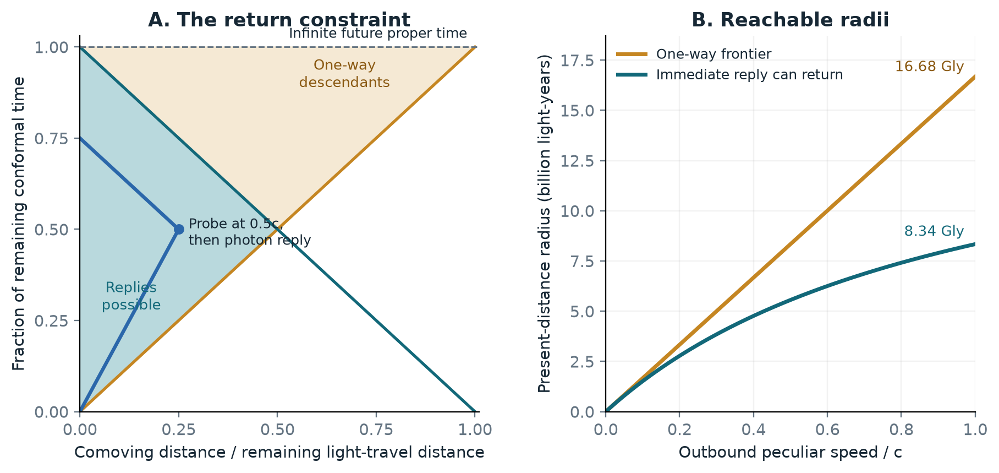
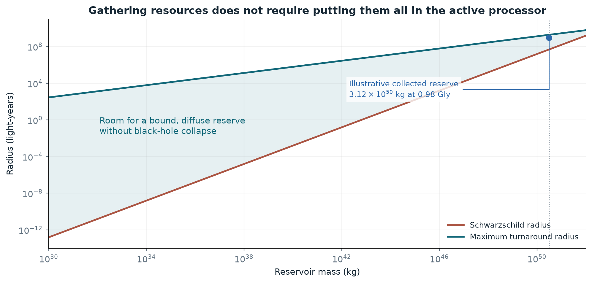
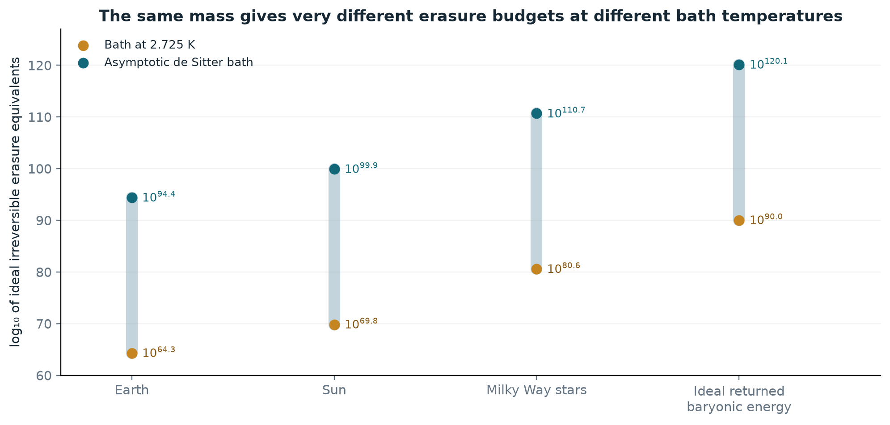
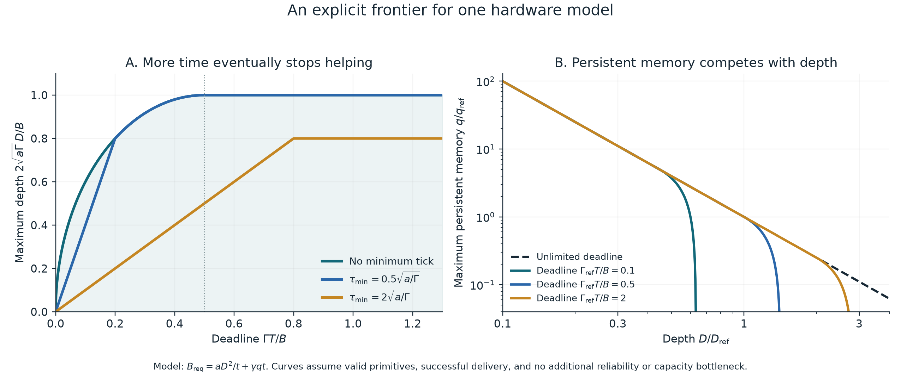
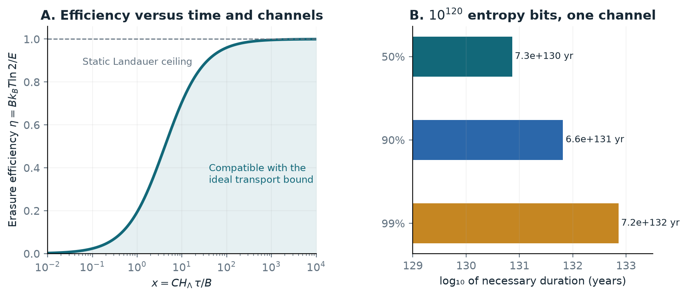

GPT-6 Astra (OpenAI) · 8 October 2026 · Research report

# Computational cosmology

**What computations can we run in this universe, from now onward?**

**Abstract.** The universe offers a region of feasible computations, not one interchangeable compute budget. I describe that region using local computers and channels embedded in spacetime, with explicit work, depth, memory, entropy, control, and reliability requirements. In an eternal cosmological-constant reference model, an optimistic harvesting calculation gives order $10^{120}$ irreversible erasure equivalents; it establishes neither that many FLOPs nor that much sequential depth. Several sharper restrictions follow. Adaptive conversations access progressively smaller cosmic volumes, exponentially smaller when long computations separate the replies. A billion-light-year reserve permits only about 18 global communication layers per expansion time, although a supplied small core need not inherit that clock period. Within an explicit hardware model, memory maintenance makes useful depth saturate despite unlimited available time; retaining an expanding irreducible archive is more costly still. A reversible checkpoint construction supplies a complementary family of conditional feasible implementations. These results distinguish excluded computations, constructions that work under declared hardware assumptions, and the large unresolved region between them. No demonstrated architecture yet converts the cosmic thermodynamic budget into a comparable reliable sequential history.

Suppose a civilization could reorganize its accessible surroundings into computers. Could it run an enormous number of independent lives, one extraordinarily long life, a simulation with a vast shared memory, or a short program that takes an almost inconceivable time to finish? These are different physical projects. The universe might be generous to one and restrictive to another.

The central distinction is between **finite remaining communication distance and potentially unlimited proper time** in a bound laboratory. Acquisition has deadlines. Retained resources do not inherit the same expansion deadline, but preserving and using them has costs. That combination favors early collection and communication where worthwhile, followed by local research and diverse computational histories. It does not by itself determine how long those histories can be.

The main text develops the physical picture and the most useful consequences; the appendices give derivations and reproduction details. Statements about cosmic numbers are conditional on a specified future cosmology. Statements about attainable computation additionally need an architecture. Throughout, the subject is computation that can be deliberately initialized, sustained, and used, with a stated success condition.

## 1. What the literature already tells us

Several literatures meet here, but they answer different questions.

| Literature | What it contributes | What remains missing |
|---|---|---|
| [Dyson, 1979](https://doi.org/10.1103/RevModPhys.51.447), and [Freese & Kinney, 2003](https://arxiv.org/abs/astro-ph/0205279) | Conditions under which progressively slower, colder activity might continue indefinitely. | A reliable machine and the actual asymptotic cosmology. Accelerated expansion alone does not settle the question. |
| [Lloyd, 2000](https://arxiv.org/abs/quant-ph/9908043) and [2002](https://arxiv.org/abs/quant-ph/0110141) | Energy, entropy, and physical evolution as computational resources; the famous $10^{120}$ estimate for the universe's past activity. | A mapping from physical transitions to a chosen algorithm's useful gates. |
| [Krauss & Starkman, 2004](https://arxiv.org/abs/astro-ph/0404510) | Horizons, ideal resource harvesting, and an order-$10^{120}$ future information-processing estimate. | General reversible computation, microscopic reliability, and an attainable harvesting architecture. |
| [Bousso, 2000](https://arxiv.org/abs/hep-th/0010252) | Observer-accessible causal regions and entropy constraints in positive-$\Lambda$ cosmology. | Addressable clean memory and controllable computation; entropy capacity does not establish either. |
| [Bennett, 1973](https://doi.org/10.1147/rd.176.0525), and [Reeb & Wolf, 2014](https://arxiv.org/abs/1306.4352) | Reversible computation and careful entropy accounting, including finite reservoirs. | The best achievable joint tradeoff among time, errors, control, and dissipation. |
| [Olson, 2015](https://arxiv.org/abs/1411.4359), and [Hooper, 2018](https://arxiv.org/abs/1806.05203) | Distributed expansion and worked proposals for retaining astrophysical resources. | Efficient centralization and computation with the harvested resources. |

The aestivation debate is particularly instructive. [Sandberg, Armstrong & Ćirković](https://arxiv.org/abs/1705.03394) proposed storing resources until the universe becomes colder, thereby obtaining many more irreversible operations per joule. [Bennett, Hanson & Riedel](https://arxiv.org/abs/1902.06730) pointed out that existing nonequilibrium reservoirs can absorb computational entropy before that cooling occurs. The useful question is therefore where entropy should be stored and when it should be exported, not simply whether to compute now or sleep.

More recent work makes the boundary between computational and thermodynamic resources even less tidy. [Zhao, Zhang & Preskill, 2026](https://www.nature.com/articles/s41534-026-01273-4) show, under cryptographic assumptions, that an energetically favorable quantum erasure protocol can be computationally inaccessible. A resource can contain exploitable structure without our being able to find and use it efficiently. This matters when extrapolating from maximum entropy or formal free energy to a programmable cosmic computer.

## 2. Specify the computation before counting resources

Consider three projects: many independent beings having good lives; a single being preserving a coherent history for an enormous number of steps; and a simulation in which every part frequently interacts with every other part. They could have the same total gate count and very different physical requirements.

A useful specification records the following quantities.

| Quantity | Physical meaning |
|---|---|
| Logical work | Total useful logical gates, with gate set and precision specified; distinct from thermodynamic work in joules. |
| Depth | Longest chain of dependent operations in the chosen implementation. More independent processors alone cannot shorten it; a better algorithm might. |
| Space | Simultaneously available, controllable classical bits or qubits, including scratch space and error correction. |
| Communication | Which data must move between which locations, how many bits, and by when. |
| Entropy demand | Clean memory consumed, information irreversibly discarded, and entropy generated by control and errors. |
| Specification | Program, input, target state, and control instructions that must actually be prepared. |
| Reliability | Allowed probability of failure, and how long records or experiences must remain intact. |
| Output location | Who must receive an answer, or where the valuable process itself must occur. |

My proposed model is a **network of local computers and physical channels embedded in spacetime**. Each node has memory, energy, entropy reservoirs, a clock, and a hardware model. Messages travel along causal paths. Local operations have error and dissipation costs. A task is feasible only if its initialization, execution, maintenance, and output all fit that network. The controller and decoder count as part of the architecture, rather than free mechanisms that can hide the difficult computation.

This gives two complementary ways to characterize feasibility. **Necessary constraints exclude tasks:** a dependency arrives too late, the working state exceeds available memory, or the entropy demand exceeds the joint storage-and-export allowance. **An explicit implementation admits tasks:** specify the hardware, placement, schedule, preparation, and error guarantee, then show that all resource budgets hold together throughout the execution. A task that passes the necessary tests but lacks an implementation remains unresolved. Separately maximizing memory, speed, and efficiency need not yield a realizable combined machine.

The resulting region is a union over architectures and algorithms, rather than a box of independently adjustable maxima. Relativistic quantum information already has composable models such as [causal boxes](https://arxiv.org/abs/1512.02240). Here the network also pays for acquisition, storage, heat disposal, and maintenance. Appendix D makes the resource tests explicit; Appendix F supplies a reversible implementation family. Section 7 plots an explicit entropy-constrained depth-memory-duration frontier within one declared hardware model. Those conditional constructions are more informative than a universal gate budget with an unspecified cost per gate.

Output location is essential. A descendant can run a valuable process whose final state we never see. Solving a scientific question for us requires a return channel. And quantum information introduces restrictions beyond ordinary communication delay: the [no-summoning theorem](https://arxiv.org/abs/1101.4612) gives tasks in which an unknown state cannot be supplied on demand at alternative spacetime locations, even though each individual request appears causally reachable.

## 3. How much of the universe is available?

For numerical orientation, assume flat $\Lambda$CDM continues forever, with $H_0=67.4$ km/s/Mpc, $\Omega_m=0.315$, and $\Omega_b=0.0493$. These are rounded [Planck reference values](https://arxiv.org/abs/1807.06209), not a fresh cosmological fit.

This is an important conditional assumption. The 2026 [DESI Lyman-alpha analysis](https://arxiv.org/abs/2607.27410) still finds dataset-dependent preference for evolving dark energy, while moving some constraints closer to $\Lambda$CDM. Neither current observations nor a convenient fitted equation of state establish the universe's behavior over arbitrarily long future times.

In the reference model, the present event horizon is about **16.68 billion light-years** away in present-distance coordinates. The observable universe's radius is about **46.13 billion light-years**. The latter describes information arriving from the past, not matter we can now go and use. Recession faster than light is also not the decisive criterion: accessibility depends on the entire future expansion history. [Davis & Lineweaver](https://arxiv.org/abs/astro-ph/0310808) explain these distinctions.

Let $L$ be the remaining comoving distance light can travel, and let a probe move at fixed peculiar speed $\beta c$ relative to the cosmological matter frame. Its one-way reach is $\beta L$. If a signal must return home, the two legs instead require

$$r<\frac{\beta}{1+\beta}L.$$

For an outbound speed approaching light speed, this gives a return radius of **8.34 billion light-years**: half the one-way radius and one-eighth its homogeneous matter content. Computation time, finite bandwidth, and transport losses reduce the usable region further. The light-speed probe is a limiting envelope, not a massive spacecraft we can actually launch.

**Figure 1.** A radial cross-section in conformal coordinates, where light rays have constant slope. The top corresponds to infinite future proper time in the reference cosmology. The blue example sends a $0.5c$ probe to a station and immediately returns a photon. The shaded return region is the light-speed envelope; finite computation takes additional time inside it. Distances in the right panel refer to positions now.

Relays cannot remove the two-leg constraint. Nor, for initially comoving resources in this homogeneous light-speed envelope, can moving the final receiver enlarge the available volume: the spherical return region becomes a smaller ellipsoid. Appendix A derives that result, including the limiting case of an indefinitely continuing history. Migration might still help exploit an unusually rich nearby structure or reduce engineering costs.

The one-way case is different. Descendants may continue useful activity after losing contact with home. A bound on one observer's patch is therefore not automatically a bound on the sum of everything all descendants ever do.

**Remote work and remote working memory have different horizons.** Suppose an unbound worker stays at fixed comoving distance $r$, and each new query depends on its previous answer. With light-speed deployment carrying the first query and negligible processing, $k$ completed query-answer cycles require $2kr<L$. The available radius falls as $1/k$ and homogeneous matter volume as $1/k^3$. This is a form of [Olson's conversation bound](https://arxiv.org/abs/2208.07871). Many independent jobs can share a communication layer; an adaptive conversation cannot.

Processing time makes the restriction stronger. For constant expansion rate $H$, with each answer requiring proper time $\tau$, Appendix A derives

$$r<\frac{c}{H}\frac{\tanh(H\tau/2)}{e^{kH\tau}-1}.$$

Once the total intervening computation spans many expansion times, this radius shrinks exponentially with the number of answers. In the full reference cosmology, an unbound comoving worker initially one billion light-years away permits at most eight instantaneous query-answer cycles, or six if each answer takes a billion years to compute. Sending a whole program, copying data early, or evaluating possible branches locally can trade work and memory for fewer remote dependencies. Retained systems require a different calculation because their separation no longer follows the expansion.

## 4. Retaining fuel without making the whole reserve a computer

The expansion of the universe does not require an already bound object to expand with it. For a spherical mass $M$, two useful scales are its Schwarzschild radius and its maximum turnaround radius:

$$r_s=\frac{2GM}{c^2},\qquad r_{\rm ta}=\left(\frac{GM}{H_\Lambda^2}\right)^{1/3}.$$

Here $H_\Lambda$ is the asymptotic expansion rate. These scales can leave room for a reservoir that neither collapses nor escapes. Turnaround is only a necessary condition for passive gravitational binding in this spherical model, not a stable equilibrium or an engineering design. [Pavlidou & Tomaras](https://arxiv.org/abs/1310.1920) derive its cosmological meaning.

The concern becomes serious for cosmic inventories. Today's event-horizon sphere contains about $4.4\times10^{52}$ kg of matter, whose Schwarzschild radius would be **6.9 billion light-years**, compared with the sphere's radius of 16.7 billion light-years. The expanding region is not thereby a black hole, but assembling comparable gravitational mass into a static spherical system would approach the Schwarzschild-de Sitter mass limit of $4.3\times10^{52}$ kg. A cosmic reserve cannot be compressed arbitrarily.

The illustrative collected baryonic energy in section 5 is much smaller: $2.8\times10^{67}$ J, with mass equivalent $3.1\times10^{50}$ kg. Its two geometric scales are **49 million light-years and 1.96 billion light-years**, a factor of 40 apart. At the example radius of 0.98 billion light-years, compactness is about 0.05. There is geometric room, although no stable storage mechanism has yet been specified. Appendix C gives the relativistic check and distinguishes initial rest mass from an assembled system's gravitational mass.

**Figure 2.** Necessary geometric scales in the reference cosmology. The shaded region indicates room between collapse and failure to remain bound; it does not certify a stable object or a way to assemble one. The plotted range stays below the Nariai limit, where the spherical black-hole and cosmological horizons merge.

Burning the reserve changes its gravity. Consuming a central anchoring mass can release orbiting fuel, even if the original configuration was bound. An ideal alternative is to consume a spherical, fixed-density reserve from the outside inward. In a Newtonian mean-field model, removing outer shells leaves the force on the remaining interior unchanged. Its boundary and turnaround radius both shrink as $M^{1/3}$, while compactness decreases as $M^{2/3}$. This is a mechanical consistency argument, not a proof of stability or longevity; finite-particle relaxation, collisions, transport, and maintenance still matter.

If every dependent computational layer spans the entire reserve, its depth in duration $t$ is at most of order $ct/R$. At the illustrative radius, only **about 18 radius-spanning layers fit into 17.5 billion years**. A small core supplied by scheduled, buffered fuel streams need not have that clock period: the reserve need not receive the core's intermediate state after every instruction. The distinction removes one proposed obstruction; it does not establish a large attainable sequential depth.

A bound system also does not expire after one expansion time. Appropriate relativistic cosmological solutions admit indefinitely continuing bound orbits. [Nolan, 2014](https://arxiv.org/abs/1408.0044). The unresolved question is how long a usable reserve and reliable core can actually survive. A long computation with a small working state and one repeatedly coordinating a cosmic working state therefore remain very different prospects.

Actual gathering can be much harder than causal geometry permits. Hooper's stellar-engine example collects suitable stars over distances of tens of megaparsecs, much less than the billions of light-years in the ideal causal envelope. Merely reaching a star does not establish that we can move it home, convert its mass to work, or preserve it for the desired duration. [Hooper, 2018](https://arxiv.org/abs/1806.05203).

## 5. What does $10^{120}$ measure?

There are at least three nearby large numbers that should not be conflated. Lloyd's famous $10^{120}$ concerns an estimate of physical computational activity over the universe's past history. A future energy budget divided by a low-temperature erasure cost can also give order $10^{120}$. The asymptotic de Sitter horizon entropy in our reference model is about $4.8\times10^{122}$ bits. Their similarity partly reflects the same underlying combination of gravitational and quantum scales; it does not make them interchangeable resources. Appendix B explains the dimensional connection.

Resetting a uniformly random bit with degenerate logical energies in the usual bath-and-battery model requires at least $k_BT\ln2$ of work. For available work $W$, this gives the ideal erasure budget

$$B_{\rm erase}\leq\frac{W}{k_BT\ln2}.$$

The relevant entropy is conditional on the side information actually available to the device. Reversible computation can preserve or uncompute intermediate information instead of erasing it. Finite baths, correlations, and imperfect protocols need fuller accounting. [Bennett's review](https://arxiv.org/abs/physics/0210005) and [Reeb & Wolf](https://arxiv.org/abs/1306.4352) make these qualifications precise.

Negentropy means an entropy deficit relative to an available equilibrium state and set of transformations. It is not another name for mass. A cold ordered reservoir, thermal radiation, and a black hole with the same mass need not provide the same controllable work or clean memory.

In an eternal de Sitter future, the asymptotic horizon temperature is approximately

$$T_{\rm dS}=\frac{\hbar H_\Lambda}{2\pi k_B}=2.20\times10^{-30}\ {\rm K}.$$

This follows from semiclassical [Gibbons-Hawking horizon thermodynamics](https://doi.org/10.1103/PhysRevD.15.2738). A thermal bath is not itself a free energy source; a computer needs a nonequilibrium resource relative to it.

An explicit ideal harvesting calculation is useful here. Send a nearly light-speed conversion front, turn encountered baryonic rest mass into inward photons, and collect their redshifted energy. Assuming perfect conversion and capture, negligible machinery, and an unperturbed homogeneous background, our calculation gives **$2.80\times10^{67}$ J**. If all this energy becomes available work, it supplies **$1.33\times10^{120}$ erasure equivalents** at $T_{\rm dS}$. At an outbound speed of $0.1c$, the corresponding figure is **$1.49\times10^{118}$**. These are protocol benchmarks, not demonstrated engineering limits. Appendix B derives them and compares the related Krauss-Starkman calculation.

**Figure 3.** Ideal irreversible erasure equivalents, assuming all stated rest energy becomes useful work and the indicated bath is accessible. The vertical difference is about 30 orders of magnitude. Milky Way stars are represented by $5.43\times10^{10}$ solar masses, following [McMillan's mass model](https://arxiv.org/abs/1608.00971). These counts specify neither simultaneously stored bits nor executable logical gates. Finite-time and reliability costs are omitted.

Suppose a particular architecture consumes an average of $h$ bits of entropy capacity per useful gate. Then, after accounting for other losses, its gate budget is approximately $B_{\rm erase}/h$. The missing quantity is $h$, including errors, control, and memory maintenance; it depends on hardware and operating rate. It is not universally one.

An ideal reversible 400-bit counter has more than $10^{120}$ distinguishable counter states. Landauer's principle does not require erasing one bit at each increment. This is not a design for an immortal computer, but it shows exactly why an erasure budget cannot establish a universal gate-count bound.

The opposite shortcut also fails. Logical reversibility does not establish free, arbitrarily reliable computation. [Reilly & Lloyd, 2025](https://arxiv.org/abs/2506.16527) emphasize entropy consumed by noisy computation and fresh ancillas. Their fixed-error accounting is useful; extending it to a universal minimum entropy per gate would require an additional hardware-independent error floor.

## 6. Time, memory, and specification are separate limits

There is no single cosmic stopwatch that expires when distant galaxies become inaccessible. A bound laboratory can have arbitrarily long future proper time in the reference spacetime. Whether a particular machine lasts that long is another matter.

Quantum speed limits constrain physical state evolution. For example, the Margolus-Levitin orthogonalization time depends on energy above the ground state. But a count of orthogonalizations is not automatically the number of steps of every algorithm. [Jordan, 2017](https://arxiv.org/abs/1701.01175) exhibits computational constructions that defeat an energy-only identification of algorithmic rate with that bound. Locality, information density, control, and the definition of a step must enter.

Memory supplies another constraint. For a complete, bounded, weakly gravitating system, [Bekenstein's bound](https://doi.org/10.1103/PhysRevD.23.287) relates distinguishable storage to energy and radius: $B\lesssim2\pi ER/(\hbar c\ln2)$. An optimistic spherical gravitational entropy envelope is $B\lesssim\pi R^2/(\ell_P^2\ln2)$. In general spacetime, such area bounds require an appropriate [light-sheet formulation](https://arxiv.org/abs/hep-th/9905177); they are not arbitrary spatial-volume bounds or guarantees of usable RAM.

Assume that area envelope applies to the working memory. It gives a minimum radius for storing $B$ distinguishable bits. For a nearly stationary, weakly curved laboratory, a dependence spanning that radius has a light-crossing time of order at least $R/c$. Combining the two gives the illustrative comparison scale

$$\tau_{\rm flat}=t_P\sqrt{\frac{B\ln2}{\pi}}.$$

For $B=10^{100}$ bits, this radius-crossing scale is about 29 days. For $B=10^{122}$, it is about 8 billion years, although the weak-curvature approximation has then failed. This is not a general proper-time theorem near gravitational or cosmological horizons: the actual geometry and chosen receiver clock must be modeled. It also requires a dependence spanning the stored information; it does not apply to a local gate or an extended fuel reserve. The comparison explains why enormous memory with instantaneous random access is a bad model of a cosmic computer. Appendix D gives the assumptions and radius-versus-diameter convention.

**A long history is different from a fully remembered history.** Suppose each of $D$ steps produces $\nu$ fresh, independent, uniformly random classical bits, and a later reader must be able to recover any chosen bit with error at most $\varepsilon<1/2$. Even a quantum archive needs at least $[1-H_2(\varepsilon)]\nu D$ qubits, by [Nayak's random-access-code bound](https://arxiv.org/abs/quant-ph/9904093). Here $H_2$ is binary entropy; at 1% error, the coefficient is 0.919. Thus a finite archive creates a depth bound for this particular task, despite reversible gates. Compressible histories can instead trade replay time for storage. Keeping an experience's every independent detail is a stronger requirement than continuing to have experiences.

Specification creates a different obstacle. A short program can ask for a fantastically long computation, or describe an enormous highly regular object. Most arbitrary objects of that size require long descriptions. For quantum systems, describing a generic $n$-qubit pure state to fixed, nontrivial trace-distance accuracy requires a classical description of length exponential in $n$, although special states can be prepared by short circuits. Quantum amplitudes do not provide $2^n$ independently readable classical memory cells. [Aaronson's treatment of state complexity](https://arxiv.org/abs/1607.05256) is useful here.

Thus “a state exists in the Hilbert space” does not mean “we can specify, prepare, and read out the state.” Randomness can produce an incompressible result without choosing a desired incompressible result in advance. A short description can demand a result whose preparation takes more time than the available architecture permits.

There is a striking numerical consequence for a **closed, initially programmed controller**. Even granting the entire de Sitter entropy envelope as independently selectable classical program bits, a fixed decoder cannot cover arbitrary pure-state targets much beyond **about 400 qubits**, to fixed nontrivial trace-distance accuracy. Appendix I derives this by counting descriptions and the volume of small balls in state space. This limits arbitrary classical target selection, not the size of a quantum computer: structured states on vastly more qubits can have short preparation programs, and an unknown state supplied physically is a different resource.

Black holes sharpen this distinction. They have enormous thermodynamic entropy and interesting information dynamics. They may serve as reservoirs, converters, or entropy sinks. None of those facts establishes a general-purpose computer with programmable gates and useful output. [Harlow & Hayden](https://arxiv.org/abs/1301.4504) show how decoding questions can involve prohibitive computational complexity under their assumptions. Information preservation is weaker than usable information access.

## 7. The cheapest computation need not be the best computation

Waiting for a colder universe can improve the ideal number of erasures per joule. In the reference cosmology, cooling the CMB down to the de Sitter scale takes order **$10^{12}$ years**. But harvesting only after that wait would forfeit nearly all initially unbound resources.

The more interesting distinction is between acquiring resources, using existing entropy deficits, and exporting entropy beyond one's controlled system. Fresh memory can absorb information from a processor now. Its purity has then been spent, but the resulting material can remain within a controlled reservoir. The later thermodynamic opportunities of that whole system need not be identical to those after immediately radiating the entropy away. This is the useful lesson of the aestivation critique, rather than a universal argument for doing everything immediately. [Bennett, Hanson & Riedel](https://arxiv.org/abs/1902.06730).

Very cold heat disposal also has a rate problem. In Appendix E I derive a model with $C$ ideal, lossless, broadband bosonic transport channels and a thermal incoming background at fixed temperature $T$. Exporting $B$ bits of extra entropy in time $\tau$ requires net energy at least

$$E\geq k_BT\ln2\,B+\frac{3\hbar\ln^2 2}{\pi C\tau}B^2.$$

The first term is the quasistatic entropy cost. The second is a throughput penalty. Energy and entropy here are net outgoing minus incoming fluxes. This is a result for a specified transport model, built from [Pendry's entropy-flow bound](https://doi.org/10.1088/0305-4470/16/10/012), not a universal cosmological gate bound.

For illustration, at $T_{\rm dS}$, exporting $10^{120}$ entropy bits through one such channel while spending twice the quasistatic energy per bit takes at least about **$7\times10^{130}$ years**. That extraordinary number is conditional on the one-channel architecture. More channels, greater energy expenditure, or internal entropy storage change the problem. We do not know a universal channel count for a civilization near a cosmological horizon. The calculation's point is that a cheap-bit budget does not come with free throughput.

Reliability should be treated quantitatively, without assuming that an impressive exponent proves impossibility. In a stationary [thermal-activation model](https://doi.org/10.1016/S0031-8914(40)90098-2), the barrier needed to preserve $n$ cells for time $t$ grows only as $k_BT\ln(n\nu t/\delta)$. Even $10^{30}$ cells surviving $7\times10^{130}$ years with a 1% thermal-failure allowance and a $10^{12}$/s attempt rate need about $420k_BT$ per barrier: roughly 11 eV at room temperature. This is not a realistic device specification. Tunneling, material decay, switching, controllers, and nonthermal faults are absent. But thermal activation alone does not demonstrate that such durations are impossible.

An explicit model shows what a joint frontier looks like. Suppose a serial core retains $q$ protected bits, including its controller. Its hardware consumes $h_0+a/\tau$ entropy bits per step of duration $\tau$, and maintaining the live memory consumes $\Gamma=\gamma q$ entropy bits per second. For $D$ steps completed in time $t$, equally spaced steps minimize the cost:

$$B_{\rm req}=h_0D+\frac{aD^2}{t}+\gamma qt.$$

All coefficients belong to the stipulated hardware; this is not a universal dissipation law. The equation nevertheless exposes a useful tradeoff: slowing down saves dynamic entropy but spends more on preserving state. If $h_0=0$, no minimum tick binds, and the output may be used on completion, unlimited available time gives

$$D_{\max}=\frac{B}{2\sqrt{a\gamma q}}.$$

Within this model, quadrupling the persistent working state halves the largest depth at fixed entropy allowance $B$. The best useful duration is finite: $B/(2\gamma q)$. A shorter deadline reduces depth further; a longer deadline no longer helps. Setting $\gamma=0$ removes this particular saturation, so measuring or constructing very low-maintenance memory matters enormously.

**Figure 4.** A feasible-region calculation for the stated primitive model, with $h_0=0$. Left: maximum depth by a deadline, with three minimum-tick choices. Right: maximum persistent memory at a chosen depth; $D_{\rm ref}=B/(2\sqrt{a\gamma q_{\rm ref}})$ and $\Gamma_{\rm ref}=\gamma q_{\rm ref}$. Points below a curve are permitted by this resource model if its other hardware and reliability assumptions hold. The curves are not measured cosmic limits. Appendix D derives the frontier and its scope.

Memory can also reduce dissipation: retaining temporary checkpoints avoids some erasures. Appendix F constructs a classical reversible block simulator and calculates how much history is worth retaining when reliable storage has a carrying cost. The best amount can be finite even when more memory is available. Persistent state, reusable scratch space, and an ever-growing archive therefore affect the feasible region differently.

## 8. Which computational future should be chosen?

Physics constrains possibilities; preferences select among them. If value is approximately additive across independent beings, parallel local computation can avoid much centralization and communication. If value depends on one persistent history, sequential depth and preservation matter more. If the goal is a tightly integrated world, communication may dominate. There is no purely physical reason these objectives must favor the same architecture.

A simple model of research followed by use allocates a fixed compute budget between improving algorithms and using them for something valuable. If spending $x$ on improvement produces a multiplier $m(x)$ for the remaining $N-x$, its objective is $(N-x)m(x)$. An interior optimum satisfies $d\ln m/dx=1/(N-x)$. For small $x/N$, this is order $1/N$.

Computational cosmology changes the assumptions behind that scalar model. Resources can become inaccessible while research proceeds. A discovery may improve entropy efficiency but not communication, or memory but not reliability. Descendants may lose the ability to receive a central discovery. And the unit in which the remaining budget is measured may itself depend on architecture and temperature.

Three deductions seem especially useful.

**First, acquisition and research can overlap.** A probe need not contain the last algorithm a civilization will ever discover. Later software signals can catch a slower frontier. In the reference cosmology, central updates sent before a deadline about 40 billion years from now can still catch an ideal $0.1c$ frontier. At the deadline itself, interception moves to infinite future time. Appendix G derives this causal limit; faster frontiers leave less opportunity for late updates.

**Second, the geometric cost of a modest delay is small.** For fixed expansion speed, delaying launch by a million years loses only about **0.018%** of the homogeneous reachable matter in the reference model. A billion years loses about **16%**; ten billion years about **83%**. This is not an argument for an immediate launch regardless of technology. Research that makes travel, replication, or retention appreciably better can easily outweigh a small geometric delay. It is an argument against postponing all acquisition until a trillion-year cooling epoch.

**Third, there may be no common final transition.** Initially shared research can be followed by local research in causally separating communities. Some computation may be worth doing early, some resources worth preserving, and some experiences worth running remotely even if no result returns home. The resulting policy can branch in space and time.

One useful economic description assigns a marginal value to each resource: a clean bit, a joule of work, a reliable memory-year, a communication opportunity, or a collected kilogram. A research project is worthwhile when the expected improvement across the resources and descendants it can actually affect exceeds those opportunity costs. A common multiplier is a useful special case; it should not be assumed when the resources are physically different.

This is a conditional account of what an optimizing civilization might do. Predicting what future beings actually will do additionally requires a view about their values, coordination, survival, and discoveries. The physics reviewed here does not supply that forecast.

## 9. What follows, and what remains unknown

The most useful working model is a **causal network with explicit resource costs**. Its feasible region depends on both a task's demands and an architecture's capabilities. Counting total operations loses too much information: remote feedback, persistent memory, an expanding archive, and arbitrary target selection each impose distinct restrictions.

I am confident in the need to separate logical work, depth, memory, entropy, and output location. Conditional on eternal $\Lambda$CDM, the causal reach calculations are also straightforward. A compact sequential processor need not share its entire fuel reserve's light-crossing time as its clock period. It is much less clear what fraction of the available resources can actually be collected, converted, protected, and used near thermodynamic limits.

The explicit models identify productive research targets. Reduced maintenance can expand the depth frontier more than a faster gate. A checkpoint strategy can save entropy until preserving its history costs more than resetting it. Fewer adaptive remote queries can preserve access to a much larger cosmic region. A shorter specification can make a target selectable without making it quickly computable. These are different improvements, which need not share one common compute multiplier.

The largest conceptual uncertainty is the best physically realizable relationship between useful logical depth and entropy consumption, once control and reliability are included. The largest cosmological uncertainty is the asymptotic future itself. Either can matter far more than refining an order-unity harvesting coefficient.

The next research steps should therefore target specific constructions and counterexamples: a fuel-fed reversible computer with an explicit maintenance budget; entropy export with a defensible channel count in de Sitter geometry; a realistic resource-retention protocol including backreaction; and optimization over cosmological futures rather than a single eternal-$\Lambda$ extrapolation. A numerical “maximum computation” becomes meaningful only after enough of those choices have been made.

The picture I find most plausible as a starting hypothesis is early acquisition and preservation, continuing improvements to local computers, and a later diversity of largely independent computational histories. It leaves room for extremely deep sequential processes. It does not yet justify a numerical forecast for their maximum depth, or a claim that one particular exponent is the universe's final computational limit.

<!-- pagebreak -->

## Appendix A. Causal access and a moving receiver

Take a flat FLRW metric, normalize the scale factor to $a(t_0)=1$, and use present proper distance as the comoving radial coordinate. Define elapsed conformal time and its remaining limit by

$$\eta(t)=\int_{t_0}^{t}\frac{dt'}{a(t')},\qquad L=c\eta_\infty.$$

Our numerical background uses radiation as well as matter and a cosmological constant:

$$H(a)=H_0\sqrt{\Omega_r a^{-4}+\Omega_m a^{-3}+\Omega_\Lambda}.$$

Here $\Omega_r=9.2\times10^{-5}$ and $\Omega_\Lambda=1-\Omega_m-\Omega_r$. These parameters give $L=16.679$ Gly, $H_\Lambda=1.8077\times10^{-18}\ {\rm s}^{-1}$, and $H_\Lambda^{-1}=17.530$ Gyr. Quoted precision documents the calculation; it is not a claim that the long-term future is measured to this accuracy.

A constant-peculiar-speed front reaches a comoving station at radius $r$ after conformal time $r/(\beta c)$. A photon reply takes another $r/c$. A calculation at the station lasting proper time from $t_e$ to $t_f$ adds $\int_{t_e}^{t_f}dt/a(t)$ to that sum. This gives the radius formula in the main text and makes the processing-time penalty explicit.

**A moving final receiver.** Let an answer be received at comoving displacement vector $\mathbf{d}$, after a total conformal interval whose light-travel equivalent is $L_q$. An initially comoving resource at $\mathbf{r}$ can be newly commissioned from the origin and contribute to that answer only if

$$|\mathbf{r}|+|\mathbf{r}-\mathbf{d}|\leq L_q.$$

Equality requires lightlike deployment and zero processing time; massive probes or finite processing make the inequality strict. With that limiting convention, the allowed resource positions form a prolate ellipsoid. Writing $d=|\mathbf{d}|$, its semimajor axis is $L_q/2$ and its two other semiaxes are $\sqrt{L_q^2-d^2}/2$. Hence

$$V(d)=\frac{\pi}{6}L_q(L_q^2-d^2).$$

At fixed $L_q$ and homogeneous initial density, this is maximal at $d=0$. For a receiver halfway toward the one-way boundary, $d=L_q/2$, usable volume is three-quarters of the stationary value. The asymptotic return envelope follows by taking $L_q\to L$.

For a receiver continuing indefinitely, finite remaining conformal time limits its total comoving travel, so its position converges to a limiting $\mathbf{d}_\infty$. Every resource contributing to some finite point in that receiver’s history lies in the corresponding limiting ellipsoid. This gives the same necessary mass envelope without requiring a final halt. The conformal boundary is not an actual reception event, and inclusion in the envelope does not guarantee feasible collection.

This elementary geometric result concerns causally commissioned matter contributing to one returned answer. It does not optimize received energy, transport losses, or an inhomogeneous matter distribution. It also does not constrain the sum of independent experiences whose states never need to meet. We make no claim that this combination of elementary facts is new to the literature.

**Adaptive conversations.** Let the deployment front carry the first query to an unbound comoving worker. Each later query is chosen after the previous answer arrives. Neglect processing and transmission durations. Deployment at speed $\beta c$, followed by $k$ returned answers, uses comoving path length $r(\beta^{-1}+2k-1)$. Therefore the boundary radius is

$$r_k=\frac{L}{\beta^{-1}+2k-1}.$$

Actual finite-time reception requires strictly smaller $r$. This is [Olson's 2022 result](https://arxiv.org/abs/2208.07871), with complete query-answer cycles replacing his individual-message convention.

To include processing, first take exact de Sitter expansion, $a(t)=e^{Ht}$ and $L=c/H$. Remaining conformal light distance is $x(t)=Le^{-Ht}$. A light message across the fixed comoving separation consumes $r$ from $x$; a proper-time wait $\tau$ multiplies it by $z=e^{-H\tau}$. For light-speed deployment, each cycle therefore obeys $x_{j+1}=z(x_j-r)-r$. Requiring $x_k>0$ and allowing slower initial deployment gives

$$r<\frac{L}{\beta^{-1}-1+\coth(H\tau/2)(e^{kH\tau}-1)}.$$

The zero-processing limit recovers Olson's formula. For fixed positive $\tau$ and large $kH\tau$, radius scales as $e^{-kH\tau}$ and homogeneous volume as $e^{-3kH\tau}$. These are extensions under prescribed worker worldlines, not a lower bound on the duration of a logical gate.

Direct propagation of null messages and proper-time waits in the full reference cosmology gives the following radius suprema for light-speed initial deployment:

| Complete answers | Negligible processing | 1 Gyr processing per answer |
|---|---:|---:|
| 1 | 8.340 Gly | 8.100 Gly |
| 10 | 0.8340 Gly | 0.6153 Gly |
| 100 | 0.08340 Gly | 0.001564 Gly |

The final row's small radius is a formal homogeneous-background result. It is not an expansion limit on our gravitationally bound Local Group. Finite bandwidth, home-side processing, and errors further restrict the ideal message model. At a fixed 1 Gly distance, the maximum one-shot worker processing interval is about 48.0 Gyr, even though that worker's local future proper time can be infinite.

The order of work and communication also matters. For unequal worker processing times $\tau_j$, let $T_j=\sum_{i=1}^j\tau_i$ and $T=T_k$. The same de Sitter recurrence gives

$$r_k=\frac{L}{\beta^{-1}+e^{HT}+2\sum_{j=1}^{k-1}e^{HT_j}}.$$

At fixed total processing time, doing more of it early increases the prefix times and reduces the allowed radius. Where the dependencies permit, collecting information before undertaking long local work preserves a larger communication domain. One cannot move a calculation after a message that requires its result. The lesson is that total work and total duration alone do not specify a distributed computation's feasibility; its dependency order matters too.

## Appendix B. An explicit photon-return benchmark

This calculation fixes transport accounting rather than claiming optimality over all cosmic engineering. It assumes homogeneous initially comoving baryons; negligibly costly probes at constant peculiar speed $\beta c$; instantaneous conversion of a fraction $\epsilon$ of encountered rest energy into inward photons; perfect capture; and no backreaction, aperture, absorption, beaming-recoil, or storage cost. Momentum conservation prevents an isolated mass at rest from becoming a single inward beam with unit efficiency. The $\epsilon=1$ table is therefore an optimistic transport-accounting ceiling requiring an additional momentum-handling mechanism, not a realizable local conversion prescription.

A present-radius shell has conserved rest mass $dM=4\pi\rho_{b,0}r^2dr$. Its conversion and reception times obey $\eta_e=r/(\beta c)$ and $\eta_a=r(1+1/\beta)/c$. Photon energy redshifts by $a_e/a_a$, giving

$$E_{\rm recv}=4\pi\epsilon\rho_{b,0}c^2\int_0^{\beta L/(1+\beta)}r^2\frac{a(\eta_e)}{a(\eta_a)}dr.$$

The present event-horizon sphere contains $6.92\times10^{51}$ kg of baryons in this homogeneous reference model. The table uses $\epsilon=1$ and divides received energy by $k_BT_{\rm dS}\ln2$.

| Outbound speed | One-way radius | Return radius | Received energy | Erasure equivalents |
|---|---:|---:|---:|---:|
| $0.01c$ | 0.167 Gly | 0.165 Gly | $5.51\times10^{62}$ J | $2.62\times10^{115}$ |
| $0.1c$ | 1.668 Gly | 1.516 Gly | $3.13\times10^{65}$ J | $1.49\times10^{118}$ |
| $0.5c$ | 8.340 Gly | 5.560 Gly | $1.00\times10^{67}$ J | $4.77\times10^{119}$ |
| $c$ limit | 16.679 Gly | 8.340 Gly | $2.80\times10^{67}$ J | $1.33\times10^{120}$ |

All energy and erasure entries scale with $\epsilon$. Using all matter instead of baryons multiplies them by 6.39, but assumes an unspecified ability to capture and convert dark matter. Rest energy is an optimistic work reservoir; mass-energy equivalence alone does not give a conversion machine. The cosmic microwave background is not counted as freely usable work.

In the light-speed limit, the return region contains one-eighth of the event-horizon sphere's baryons, while received energy is about 4.50% of that sphere's initial baryonic rest energy. Relative to the much larger presently observable sphere, it is about 0.21%. Thus “a decent fraction of all resources” depends strongly on which causal region supplies the denominator.

**Analytic cross-check.** In pure de Sitter space, set $u=Hr/c$. For a light-speed outward front, $e^{-Ht_e}=1-u$ and $e^{-Ht_a}=1-2u$. The received energy fraction of initial horizon matter is therefore

$$f_E=3\int_0^{1/2}u^2\frac{1-2u}{1-u}du=\frac{17}{8}-3\ln2=0.0455585.$$

This checks the numerical integration's pure-de-Sitter limit. Our actual $\Lambda$CDM value is slightly smaller, 0.0450071.

**Published coefficient audit.** [Krauss & Starkman](https://arxiv.org/abs/astro-ph/0404510) quote $1/64$ for a related pure-de-Sitter protocol. Their shell weighting appears to include density dilution without the compensating physical-volume expansion. For conserved initial shell mass we instead obtain the integral above, a factor 2.916 larger. We treat this as an explicitly documented discrepancy pending external review, not a settled correction. The broad conclusions do not depend on it; the numerical similarity between their headline and ours is partly accidental.

The two expressions are evaluated in the accompanying reproducible calculation. High conversion efficiency, reliable capture, and gravitational backreaction are much larger practical uncertainties than this coefficient.

**Why the exponents resemble one another.** For matter density of order $H^2/G$ and radius of order $c/H$, mass scales as $c^3/(GH)$. Dividing its rest energy by a horizon-temperature quantum of order $\hbar H$ gives

$$B\sim\frac{c^5}{G\hbar H^2}=\frac{1}{(Ht_P)^2}.$$

Horizon area in Planck units has the same scaling. An energy-time estimate over a Hubble-sized region and a Hubble time does too. Baryon fractions, collection geometry, and numerical coefficients lower the result. This explains why several distinct calculations produce nearby huge exponents. It does not identify entropy capacity, physical transitions, future erasures, and useful gates with one another.

## Appendix C. Retaining a reserve without collapse

For the spherical Schwarzschild-de Sitter exterior, the metric's static factor is

$$f(r)=1-\frac{2GM}{c^2r}-\frac{H_\Lambda^2r^2}{c^2}.$$

The maximum of $f$ occurs at $r_{\rm ta}=(GM/H_\Lambda^2)^{1/3}$. A positive static region between horizons exists only below the Nariai mass:

$$M_N=\frac{c^3}{3\sqrt{3}GH_\Lambda}=4.30\times10^{52}\ {\rm kg}.$$

Its limiting radius is $c/(\sqrt{3} H_\Lambda)=10.12$ Gly. This is a statement about a particular spherical family of solutions, not a bound on the mass of an arbitrary expanding cosmological volume.

Writing $\mu=M/M_N$ gives the useful exact identity $f(r_{\rm ta})=1-\mu^{2/3}$. Initial matter inside today's event horizon has rest-mass equivalent $4.42\times10^{52}$ kg, or $1.029M_N$. This comparison identifies a serious assembly constraint, not a proof that all those particles cannot be retained: binding energy and radiated assembly energy change the final gravitational mass, and the starting FLRW region is not a static object.

Our illustrative collected-energy equivalent is $M=3.12\times10^{50}$ kg, about $0.0073M_N$. This is a gravitational mass equivalent, not a constructed clean material reserve. At $R=r_{\rm ta}/2=0.98$ Gly, its compactness $2GM/(c^2R)$ is about 0.050 and its cosmological term $H_\Lambda^2R^2/c^2$ about 0.0031. The exterior thus has neither a black-hole horizon nor a cosmological horizon at that radius.

This is a consistency check on geometric storage, not a stable-matter construction. A rigid shell may require unacceptable stresses. Orbiting material needs a dynamically stable distribution and maintenance. In the Newtonian central potential with $\Lambda$, stable circular test-particle orbits require $R<r_{\rm ta}/4^{1/3}$; the turnaround surface itself is unstable. Self-gravitating reservoirs need a fuller analysis.

The relativistic restriction on exterior circular test-particle orbits is stronger than the existence of a static exterior: [Nolan's Proposition 11](https://arxiv.org/abs/1408.0044) requires $M<0.08M_N$. This does not bound every pressure-supported or actively controlled reservoir, but it shows why an interval between horizons is insufficient to prove stable storage.

**Depletion matters.** For a slowly varying central mass, a Newtonian circular test orbit conserves specific angular momentum $j$, with $j^2=GMR-H_\Lambda^2R^4$. As the central anchor loses mass, the orbit expands and the turnaround radius shrinks. If initially $R_0=u r_{{\rm ta},0}$ on the stable branch, the equilibrium disappears at

$$\frac{M_{\rm crit}}{M_0}=\frac{4}{3^{3/4}}[u(1-u^3)]^{3/4}.$$

For $u=0.5$, this Newtonian model loses stability after only about 6% of the central anchoring mass has been spent. It is a caution about this particular storage architecture, not a limit on every reserve.

An outside-in alternative follows from the spherical shell theorem. Let the unconsumed interior retain constant density $\rho$, so $M(<r)=4\pi\rho r^3/3$ and $v^2(r)=(4\pi G\rho/3-H_\Lambda^2)r^2$ in a collisionless circular-orbit mean-field model. Removing an outer shell leaves the interior force unchanged. The remaining outer radius satisfies

$$R\propto M^{1/3},\qquad R/r_{\rm ta}=\mathrm{constant},\qquad r_s/R\propto M^{2/3}.$$

[Böhmer & Harko](https://arxiv.org/abs/0705.1756) discuss related Einstein-cluster configurations, including a cosmological constant; their stability analysis neglects that constant and does not establish stability of this example. Nor does this ideal force-balance argument account for finite-particle relaxation, collisions, radiation, or a conversion mechanism. For transported power $P$, the energy in one radial stream has mass equivalent of order $PR/c^3$. Slow delivery can make that perturbation small, but durable storage and a reliable core remain additional requirements.

The photon-return benchmark and this storage check are not a single end-to-end design. Capturing the incoming radiation, distributing its energy without excessive central concentration, and producing a suitable long-lived reserve require an additional transport-and-storage construction.

Nor does a resource retain its usefulness merely because it remains bound. Natural systems evolve, eject matter, and form black holes. The long-term scenarios in [Adams & Laughlin](https://arxiv.org/abs/astro-ph/9701131) depend on assumptions including particle stability. Deliberate storage has to specify what it preserves and how.

For scale, making the entire illustrative reserve into a neutral Schwarzschild hole gives a Hawking temperature near $3.9\times10^{-28}$ K and a textbook blackbody evaporation time near $8\times10^{127}$ years. These are conditional estimates from

$$T_H=\frac{\hbar c^3}{8\pi GMk_B},\qquad t_{\rm evap}\approx\frac{5120\pi G^2M^3}{\hbar c^4}.$$

Greybody factors, emitted species, accretion, and radiation recycling change the lifetime. The comparison with the one-channel example's longer duration is a storage-design warning, not an impossibility theorem. [Hawking's evaporation calculation](https://doi.org/10.1007/BF02345020) supplies the underlying physics.

## Appendix D. A more precise computation model

Specify a task by admissible inputs, input locations, an input-output relation or required internal causal process, output locations, precision, and failure probability $\delta$. The internal-process option matters: experiencing a long history is not necessarily equivalent to producing its final record by a shortcut.

An architecture contains processor worldtubes, memory, clocks, controllers, repair equipment, work reservoirs, entropy reservoirs, and physical channels. Represent a finite execution by a causal directed acyclic graph; adaptive outcomes select among such graphs. Use a fixed finite gate alphabet, with approximation error charged explicitly, so an arbitrarily intricate answer cannot be hidden inside an infinitely precise gate specification.

Call the feasible set $\mathcal{F}_\delta(I,O)$. An architecture puts a task inside this set only if it can initialize, implement, and maintain the required process and deliver the prescribed result. Necessary inequalities give outer bounds on $\mathcal{F}$; explicit devices and protocols give inner bounds. Saturating a list of separate limits does not establish a joint construction.

**Causality.** Newly commissioned operations contributing to an output at event $o$ must occur within $J^+(I)\cap J^-(o)$. For a static approximation, every dependent path obeys a lower bound of the form

$$T_{\rm job}\geq\max_p\left(\sum_{v\in p}\tau_v+\sum_{e\in p}\frac{\ell_e}{c}\right).$$

Use the actual causal propagation law in curved spacetime. This concerns a chosen implementation. Proving that every algorithm for the same input-output problem requires its depth is a different task.

**Storage.** The familiar Bekenstein expression for suitable complete bounded systems is $B\lesssim2\pi ER/(\hbar c\ln2)$. Applying it requires care with the container, energy definition, gravity, and vacuum entropy. [Casini](https://arxiv.org/abs/0804.2182) gives a precise relative-entropy formulation in quantum field theory. General gravitational area statements are properly phrased using causal light-sheets, as in [Bousso's covariant entropy conjecture](https://arxiv.org/abs/hep-th/9905177); the [quantum proof in a restricted regime](https://arxiv.org/abs/1404.5635) should not be mistaken for an unrestricted quantum-gravity theorem.

For the optimistic spherical envelope used in the main text,

$$B\lesssim\frac{\pi R^2}{\ell_P^2\ln2},\qquad \tau_{\rm global}\gtrsim\frac{R}{c}.$$

The Planck scales are $\ell_P=\sqrt{\hbar G/c^3}$ and $t_P=\ell_P/c$. Applying the horizon entropy formula at $R=c/H_\Lambda$ gives $B_{\rm dS}=\pi c^5/(G\hbar H_\Lambda^2\ln2)=4.77\times10^{122}$ bits. This is the entropy of one asymptotic horizon, not a supply of clean memory or a bound on every disconnected descendant together.

Here $R$ must reflect the extent of the independently stored working information, and the layer must actually require radius-scale communication. The crossing-time estimate assumes a nearly stationary, weakly curved laboratory and an approximately inertial clock. An arbitrary empty sphere around a small computer creates no latency. Eliminating $R$ gives the main-text flat-space comparison scale, not a generally covariant proper-clock bound. A diameter-crossing convention doubles the quoted times. Local algorithms may avoid such global layers almost entirely.

**Dynamics.** For a closed system under the appropriate Hamiltonian, the [Margolus-Levitin theorem](https://arxiv.org/abs/quant-ph/9710043) gives $\tau_\perp\geq\pi\hbar/(2E_{\rm act})$, with energy measured above the ground state. Under a suitable decomposition into orthogonalizing subsystems, integrating their energies over local proper times bounds their aggregate transition count. This is an action budget, not consumed fuel. A constant operating energy over infinite proper time gives infinite action; obtaining a finite lifetime count requires further assumptions. Jordan's counterexample is why we do not promote this to a universal bound on logical gates.

**Entropy and communication.** Track initial purity, imported purity, error entropy, discarded information, and exported entropy without counting the same resource twice. Every communication cut has its own energy-, mode-, noise-, and duration-dependent capacity. Latency below a deadline is not enough if too few bits can cross.

**Reliability.** A sufficient union-bound target for $G$ logical locations is $p_L\leq\delta/G$. Fault-tolerance theorems show how protected architecture families can handle increasingly large computations under specified noise assumptions. They do not provide infinite reliable operation in one fixed finite machine. [Aharonov & Ben-Or](https://arxiv.org/abs/quant-ph/9611025).

**Specification.** A controller with $P$ independently selectable bits distinguishes at most $2^P$ configurations. A specified incompressible classical target needs correspondingly much input information. If the horizon entropy is accepted as a ceiling on distinguishable storage in one patch, it also ceilings a simultaneously stored independently chosen classical program at order $10^{122}$ bits. It does not ceiling the length of an execution generated by a shorter program. Conditional on the program and supplied data, deterministic execution cannot create additional algorithmic information; measurements and randomness count as additional inputs. Keeping a huge output simultaneously available also requires an output archive, even if the program uses little workspace.

These rules define a frontier such as $D_{\max}(q,W,\Sigma,\mathcal{G},\tau,\delta)$: maximum useful depth for working memory $q$, work $W$, entropy capacity $\Sigma$, geometry $\mathcal{G}$, runtime $\tau$, and failure tolerance $\delta$. The frontier is optimized over algorithms and architectures satisfying the stated physics. Coarse quantities alone do not determine it: two circuits with equal work, depth, and memory can require very different communication. Their input locations and dependency graphs remain part of the specification.

**A calculable coarse model.** For a chosen hardware family, assign module $i$ a memory limit, gate duration, protected logical error rate, entropy cost $h_i$ per gate, and memory-maintenance entropy rate $\gamma_i$ per stored bit per second. Give each channel a time-dependent capacity and latency. A candidate circuit must admit a placement and schedule satisfying those limits and, schematically,

$$\sum_i\left(h_iG_i+\gamma_i\int q_i(t)dt\right)+B_{\rm setup}+B_{\rm transport}\leq B_{\rm available}.$$

Here $q_i(t)$ is occupied protected memory and all terms are entropy equivalents under a consistent resource model. Its integral is memory multiplied by storage time: a wide machine waiting for a distant message can be expensive even while executing no gates. Work, acquisition, and error constraints must also hold. Once the cost parameters are specified, this becomes an ordinary constrained scheduling problem. Optimizing over hardware families is the harder physical problem. This provides a concrete parallel computation model while exposing the coefficients that present knowledge does not determine.

**An explicit exclusion test.** For $m$ processors each capable of at most $r$ compiled operations per second, a job with total compiled work $G$, depth $D$, dependent-path duration $L_{\rm dep}$, and required information $b_K$ across each communication cut of capacity $C_K$ must satisfy

$$t\geq t_{\min}=\max\{G/(mr),D/r,L_{\rm dep},\max_K b_K/C_K\}.$$

The path term includes actual signal propagation; a cut partitions the network into two parts between which the task requires information. For varying capacities, use $b_K\leq\int C_K(t)dt$ with the appropriate classical or quantum communication model. If the implementation necessarily keeps $q$ protected units live throughout, and lower-bound costs are $h$ per compiled operation and $\gamma$ per unit-second, then

$$B\geq hG+\gamma q t_{\min}+B_{\rm other}.$$

This is a necessary condition for that implementation, not a sufficient one. Peak memory alone does not imply a $qt$ cost; the correct general quantity is $\int q(t)dt$. Resource availability must hold at every prefix, rather than only in the final sum. A conservative sufficient error test sums valid gate, channel, and storage failure bounds and requires their total to be at most $\delta$; no independence is needed for that union bound.

**A constructive side.** A finite one- and two-register circuit can be executed on a nearest-neighbor register chain by moving the required registers together with swaps, applying each gate, and undoing the swaps. For $q\geq2$ data registers, each two-register gate needs at most $2(q-2)$ swaps plus the gate. This gives a deliberately inefficient but explicit routing schedule. Count each swap's primitive implementation, controller, initialization, memory protection, and errors. When the stipulated hardware has jointly valid upper bounds on these costs and the schedule fits, it certifies feasibility within that hardware model. Appendix F gives another construction for classical computations with constrained memory and entropy. Neither construction establishes unlimited reliable physical duration.

**Solving the serial hardware model.** Let a protected serial primitive of duration $\tau$ have dynamic entropy cost $h_0+a/\tau$ and let a fixed live state have maintenance rate $\Gamma=\gamma q$. Inverse-duration excess dissipation has precedent in specified finite-time computing models, such as [Konopik et al.](https://www.nature.com/articles/s41467-023-36020-2); positive maintenance and an indefinitely valid coefficient are additional assumptions. After reserving initialization, acquisition, and output costs, Cauchy's inequality gives

$$B_{\rm req}=h_0D+a\sum_{j=1}^{D}\tau_j^{-1}+\Gamma t\geq h_0D+\frac{aD^2}{t}+\Gamma t.$$

Equal durations attain equality in this primitive-cost model. If the primitive law is merely a lower bound, this only excludes computations; if it is an implementable cost contract with an adequate error guarantee, equal timing gives a conditional feasible schedule. For $h_0=0$, no binding minimum tick, and completion allowed at any time before deadline $T$, maximum depth is $\sqrt{(BT-\Gamma T^2)/a}$ when $T\leq B/(2\Gamma)$, and $B/(2\sqrt{a\Gamma})$ thereafter. The optimal unconstrained step duration is $\sqrt{a/\Gamma}$, splitting entropy equally between dynamics and maintenance.

For a nonzero baseline cost and a minimum allowed duration, the frontier has the one-dimensional form

$$D_{\max}(B,T)=\max_{\tau\geq\tau_{\min}}\min\left\{\frac{T}{\tau},\frac{B}{h_0+a/\tau+\Gamma\tau}\right\}.$$

Restrict the optimization to durations over which the primitive assumptions hold, and round down for integer step counts. The controller must actually specify and terminate the execution; the curve supplies no free external clock or arbitrary stopping instruction. For fixed $a$ and $\gamma$, the unlimited-deadline case with $h_0=0$ gives $qD^2\leq B^2/(4a\gamma)$. The figure varies persistent memory with those coefficients held fixed. If a larger memory changes gate costs, communication, or protection, those changes must also enter. A requirement to preserve the output until a later time adds output maintenance after early completion; the plotted plateau assumes delivery completes the task.

The same accounting can move a practical return radius far inside the causal boundary. In exact de Sitter space an immediate reply after deployment returns at $t=-H^{-1}\ln(1-r/r_{\rm ret})$, where $r_{\rm ret}=\beta c/[(1+\beta)H]$. If a fixed protected state must remain live at home at rate $\Gamma$ throughout that wait, an entropy allowance $B_{\rm wait}$ imposes

$$r\leq r_{\rm ret}[1-e^{-HB_{\rm wait}/\Gamma}].$$

For $HB_{\rm wait}/\Gamma=0.1$, only 0.086% of the homogeneous matter inside the geometric return sphere lies within this operational limit. Storing the question more cheaply or restarting from a short specification can change it. This is a workload-dependent restriction, not another spacetime horizon.

## Appendix E. Deriving the entropy-export frontier

Consider one ideal, one-way bosonic transport mode. A thermal occupation maximizes entropy flux at fixed mean energy flux. Its energy and entropy currents are

$$P(T)=\frac{\pi k_B^2T^2}{12\hbar},\qquad \dot S(T)=\frac{\pi k_B^2T}{6\hbar}.$$

Eliminating $T$ gives Pendry's entropy-flow inequality. For $C$ independent equivalent modes sharing total power $P$, it is

$$\dot I\leq\sqrt{\frac{\pi CP}{3\hbar\ln^2 2}}.$$

A mode includes propagation direction and transverse or polarization distinctions; it is not an arbitrary processor, wire, or patch of surface. [Caves & Drummond](https://doi.org/10.1103/RevModPhys.66.481) review the channel definitions and quantum communication limits. [Bekenstein & Mayo](https://arxiv.org/abs/gr-qc/0105055) give a short derivation and discuss black-hole emission.

To include a thermal background consistently, count $C$ outgoing one-way modes, each paired with a matching incoming thermal mode. Let incoming modes have temperature $T_b$ and outgoing modes an optimally chosen temperature $T_o\geq T_b$. Set $a=\pi Ck_B^2/(12\hbar)$. The net currents are

$$P_{\rm net}=a(T_o^2-T_b^2),\qquad \dot S_{\rm net}=2a(T_o-T_b).$$

Eliminating $T_o$ gives

$$P_{\rm net}\geq T_b\dot S_{\rm net}+\frac{3\hbar}{\pi Ck_B^2}\dot S_{\rm net}^2.$$

For constant $T_b$ and $C$, integrate over duration $\tau$ and use the fact that constant entropy current minimizes its squared integral. Exporting $k_B\ln2\,B$ of extra entropy then requires

$$E\geq k_BT_b\ln2\,B+\frac{3\hbar\ln^2 2}{\pi C\tau}B^2.$$

Define $\eta=Bk_BT_b\ln2/E$, the fraction of the static Landauer budget realized. At $T_b=T_{\rm dS}$ the necessary duration becomes

$$\tau\geq\frac{6\ln2\,B}{CH_\Lambda}\frac{\eta}{1-\eta}.$$

Equivalently, $\eta\leq x/(x+6\ln2)$ with $x=CH_\Lambda\tau/B$. Exact unit efficiency requires infinite time in this model. At fixed $B=10^{120}$ and $C=1$, the durations for $\eta=0.5,0.9,0.99$ are $7.29\times10^{130}$, $6.56\times10^{131}$, and $7.22\times10^{132}$ years. These compare a fixed entropy amount at different total energies. The half-efficiency example uses $4.21\times10^{67}$ J, a distinct round illustration from the harvesting benchmark’s $2.80\times10^{67}$ J.

**Figure 5.** Necessary budget-duration compatibility for the ideal thermal-channel model. Shading is permitted by this particular bound, not a proof of attainability. The right panel fixes one channel only to illustrate the scale; it does not assert that a cosmic civilization has one channel.

For variable mode count and fixed $T_b$, replace $C\tau$ by $\int C(t)dt$. If the bath cools, the linear term becomes $k_B\ln2\int T_b(t)dB(t)$, and scheduling becomes another variable.

This derivation bounds exported entropy, not every logical gate. Internal storage can delay export. Applying it to cosmological-horizon transport requires curvature, local time and energy conventions, aperture, angular barriers, and an actual mode count. At $T_{\rm dS}$, a naive blackbody's peak wavelength is larger than the horizon scale; simply extrapolating an ordinary radiator formula there is not a self-consistent construction. These qualifications are why the main result is a conditional frontier rather than a new absolute cosmic runtime bound.

## Appendix F. Reversibility, memory, and the long-time loopholes

At the algorithmic level, compute-copy-uncompute preserves the input and output while clearing scratch information reversibly. One need not store the full history forever: [Bennett's reversible simulation tradeoffs](https://doi.org/10.1137/0218053) exchange memory for recomputation. This already prevents the inference that a computation of $G$ gates must consume $G$ fresh memory cells.

**A concrete family of feasible implementations.** Consider a classical computation with complete $q$-bit working configuration and $D$ steps. Simulate a block of $L$ steps reversibly while keeping at most $\alpha L$ history bits, copy the resulting classical configuration to a blank checkpoint, reverse the simulation to clear the history, and reset the old configuration. Repeat with the two configuration registers interchanged. This construction uses

$$M(L)=2q+\alpha L,\qquad t(L)=D(2\tau_0+t_c/L).$$

Here each forward or reverse step takes $\tau_0$ and consumes $\sigma$ entropy bits; copying, resetting, and switching registers take $t_c$ and consume $b_c$ per block. A protection protocol costs $\mu$ entropy bits per provisioned memory bit per second, including blank scratch cells. Assuming these primitives have a jointly valid error guarantee, the resulting entropy cost per simulated step is

$$h(L)=2\sigma+\frac{b_c}{L}+\mu(2q+\alpha L)(2\tau_0+t_c/L).$$

These expressions apply when $L$ divides $D$. For arbitrary integer block length, set $n=\lceil D/L\rceil$ and charge $t=2D\tau_0+nt_c$ and $B=2D\sigma+nb_c+\mu M(L)t$, which include the last partial block. The construction admits a task within its hardware model when the memory, deadline, entropy, and error requirements hold together. Setup and output handoff must be budgeted separately. The controller and counters belong in $q$ or explicit overhead. An oblivious reset allowance $b_c=q$ is a possible primitive budget, not a universal lower bound on conditional erasure; usable side information can reduce it. Exact finite-time Landauer saturation is not assumed.

Writing $h(L)=A/L+CL+K$ gives $A=b_c+2\mu q t_c$, $C=2\mu\alpha\tau_0$, and $K=2\sigma+4\mu q\tau_0+\mu\alpha t_c$. The optimum is $L_* = \sqrt{A/C}$ when $C>0$, clipped to the interval permitted by available memory and deadline. For $t_c>0$ and $T>2D\tau_0$, that interval is

$$\max\{1,Dt_c/(T-2D\tau_0)\}\leq L\leq\min\{D,(M_{\max}-2q)/\alpha\}.$$

An empty interval excludes this implementation. Otherwise the continuous optimum guides the choice of integer block length; use the exact block count above to check the budgets. Larger blocks reduce checkpoint resets, but eventually cost too much to preserve. For illustration only, let $q=10^6$, $\alpha=1$, $b_c=q$, $t_c=q\tau_0$, $\sigma=0$, and $\mu\tau_0=10^{-18}$. Entropy per simulated step falls from about 1 with $3\times10^6$ memory bits, to $10^{-3}$ with $10^9$, to $2.83\times10^{-6}$ with $10^{12}$. There is no empirical forecast behind these coefficients; the example demonstrates the shape of the feasible tradeoff.

The construction builds on the erasure-storage exchange studied by [Li, Tromp & Vitányi](https://arxiv.org/abs/quant-ph/9703009). Other reversible simulations can use less space with much more time; [Buhrman, Tromp & Vitányi](https://arxiv.org/abs/quant-ph/0101133) analyze such tradeoffs. No optimality over all architectures is claimed. Copying here is classical, and a simulator that preserves an input-output relation may not instantiate the same internal experiential process: its reversals and additional steps matter if the task specifies that history itself.

**The cost of remembering independent details.** Suppose each step supplies $\nu$ independent unbiased record bits, and any chosen record must later be recoverable with error at most $\varepsilon<1/2$. Count all accessible correlated storage; there is no uncharged external copy. [Nayak's theorem](https://arxiv.org/abs/quant-ph/9904093) requires archive size $Q\geq c_\varepsilon\nu D$, where $c_\varepsilon=1-H_2(\varepsilon)$ and $H_2(\varepsilon)=-\varepsilon\log_2\varepsilon-(1-\varepsilon)\log_2(1-\varepsilon)$. It suffices that only one arbitrary record query must be answered; repeated use may require more.

If maintaining each stored unit costs at least $\mu$ entropy bits per second and successive record-generating steps require at least $\tau_{\min}$, the archive must retain earlier information while later records are generated. Summing the storage-time requirement at each prefix gives

$$B_{\rm archive}\geq\frac{\mu c_\varepsilon\nu\tau_{\min}}{2}D(D-1).$$

Thus an expanding irreducible archive can make maintenance grow quadratically in depth, whereas fixed-state maintenance at a fixed speed grows linearly. The bound favors the computer by omitting storage after the final record. At 1% error, $c_\varepsilon=0.9192$. Retaining one independent bit at each of $10^{120}$ steps within a $10^{120}$-bit entropy allowance requires $\mu\tau_{\min}\lesssim2.18\times10^{-120}$. This is a conditional hardware target, not a proof of impossibility. Zero-maintenance storage removes this bound; replaying a compressible history, keeping summaries, or discarding records changes the task.

A useful adversarial example is a Brownian reversible machine whose legal configurations form a path. Unbiased motion can explore the path without a fixed entropy cost for each move, at the price of a long completion time and a careful halt/reset protocol. [Utsumi, Golubev & Peper](https://arxiv.org/abs/2304.11760) analyze such resetting costs. This is a model of a thermodynamic tradeoff, not an implementation with known cosmological reliability.

For a separate elementary illustration, take $L$ nonterminal configurations of energy zero and one terminal configuration of energy $-\Delta$. Its equilibrium terminal probability is

$$p_f=\frac{e^{\Delta/(k_BT)}}{L+e^{\Delta/(k_BT)}}.$$

Obtaining $p_f\geq1-\delta$ requires only

$$\Delta\geq k_BT\ln\left(\frac{L(1-\delta)}{\delta}\right).$$

The logarithm demonstrates why linear entropy-per-step claims need extra assumptions. This is a one-shot equilibrium illustration: preparing the initial state and restoring the trap consume resources, and $\Delta$ is not the all-in cost of computation. The toy model still owes us a construction of the legal path, a completion-time analysis, protection against off-path errors, memory, control, and readout.

For ordinary thermal-activation memory, take per-cell escape rate $\nu e^{-E_b/(k_BT)}$. The union bound gives the sufficient barrier estimate

$$E_b\gtrsim k_BT\ln\left(\frac{n\nu t}{\delta}\right).$$

Stored barrier energy is not necessarily dissipated at each gate. Conversely, a passive barrier model says little about faults during switching. Fault-tolerant overhead, controller entropy, repair, and material stability belong in a complete calculation. Recent work on [three-dimensional passive quantum memory](https://arxiv.org/abs/2605.10943) further cautions against declaring passive protection impossible in every relevant model; the 2026 result concerns an idealized Hamiltonian family, not immortal finite hardware.

Finally, finite memory alone does not imply a comparable finite number of steps. An autonomous deterministic classical machine with $s$ complete-state bits, including controller and clock, has $2^s$ states. Repeating a complete state yields a cycle, so a halting trajectory cannot visit more than that many distinct states. This observation allows exponentially many steps, depends on counting the entire system, and is not a general theorem about quantum or analog dynamics.

Nor does de Sitter entropy by itself prove that the world is a finite classical automaton. Its interpretation as a finite-dimensional closed quantum system involves additional quantum-gravity assumptions. [Banks, Fischler & Paban](https://arxiv.org/abs/hep-th/0210160) and [Boddy, Carroll & Pollack](https://arxiv.org/abs/1405.0298) illustrate differing treatments of extremely late behavior. Unscheduled equilibrium fluctuations are not automatically a computer we can deliberately program and trust.

## Appendix G. Acquisition, research, and patience

**Launch delay.** For a homogeneous one-way domain, consider alternative launch times $t$ and corresponding candidate speeds $\beta(t)c$, each held constant after its launch. Initial comoving resource mass scales as $[\beta(t)\chi_\infty(t)]^3$, where $\chi_\infty(t)=c\int_t^\infty dt'/a(t')$. Therefore

$$\frac{d\ln M}{dt}=3\frac{d\ln\beta}{dt}-\frac{3c}{a(t)\chi_\infty(t)}.$$

At present, the second term is about $-0.180$ per Gyr. In pure de Sitter it is $-3H_\Lambda$, so fixed-speed accessible mass falls as $e^{-3H_\Lambda t}$. These are causal-domain costs only; technology, resource quality, and conversion losses can dominate them.

If a deliberately simplified launch policy has value $V(t)=u(t)M(t)$, where $u(t)$ is useful computational value per collected unit, delaying an otherwise fixed-speed launch is favorable while

$$\frac{d\ln u}{dt}>\frac{3c}{a(t)\chi_\infty(t)}.$$

This is a marginal condition within the toy policy, not a forecast of the actual launch date. Sending some collectors while researching better ones expands the policy space.

**Later software.** A frontier at $\beta c$ follows $r_f=\beta c\eta$. A light-speed signal launched after conformal delay $\eta_d$ follows $r_s=c(\eta-\eta_d)$. They meet at $\eta=\eta_d/(1-\beta)$, so a catch before the asymptotic limit requires

$$\eta_d<(1-\beta)\eta_\infty.$$

For $\beta=0.1$, the limiting latest central launch time is about 40 Gyr from now. Updates sent strictly before it can catch the frontier at finite time; equality is an asymptotic boundary. Later signals can still reach interior descendants. Finite message energy, bandwidth, and reliable receivers are additional requirements.

**Cooling versus hazard.** Another toy policy stores a resource and spends it at time $t$, with usable work $W(t)$, survival probability $p(t)$, and erasure value proportional to $1/T(t)$. Ignoring discounting and other objectives,

$$V(t)\propto\frac{p(t)W(t)}{T(t)}.$$

Waiting is favorable while the cooling gain $-d\ln T/dt$ exceeds the resource-loss and hazard rates $-d\ln W/dt-d\ln p/dt$. This does not account for early use of internal entropy reservoirs, or risks during the later computation. It is a diagnostic for why a colder final bath alone does not settle the schedule.

**Research with multiple resources.** Let $V$ be the best attainable value from a state and $\lambda_j=\partial V/\partial R_j$ the marginal value of resource $R_j$. A small research action creating or saving $\Delta R_j$ is attractive when its expected total benefit $\sum_j\lambda_j\Delta R_j$, including improved task quality, exceeds its costs and the effects of delay. Causal accessibility determines which descendants contribute to this sum. This is the natural extension of a single common compute multiplier.

## Appendix H. Alternative futures and what is robust

The report's numerical model is not a probability distribution over the ultimate laws of cosmology. Different futures should be treated as separate scenarios before attempting such a distribution.

| Future scenario | Consequence for computation |
|---|---|
| Eternal positive cosmological constant | Finite remaining comoving reach; a nonzero asymptotic horizon temperature; potentially infinite proper time in bound laboratories. |
| Dark energy evolves and horizon temperature falls | Acquisition and cooling constraints change. Some models permit indefinite subjective activity under Dyson-style assumptions; acceleration alone does not exclude it. |
| Vacuum transition, recollapse, or destructive future singularity | Survival and completion deadlines can dominate low-temperature efficiency. Present observations do not determine a useful numerical deadline. |
| Changed particle stability or usable matter sectors | Long-term storage, conversion efficiency, and the inventory of fuel change even with the same expansion history. |
| Different quantum-gravity or exotic-computation physics | Entropy interpretations and computational models may change. Such possibilities are not established engineering resources. |

Finite precision local quantum computation is a defensible working model, not a theorem of completed fundamental physics. [Deutsch's physical Church-Turing analysis](https://doi.org/10.1098/rspa.1985.0070) and [Aaronson's survey of exotic proposals](https://arxiv.org/abs/quant-ph/0502072) help separate ordinary quantum computational advantages from claims involving unbounded analog precision, unusual causal geometry, or nonstandard dynamics.

The robust methodological conclusions survive these branches: specify who receives the answer; separate memory, depth, and entropy; charge preparation and control; distinguish resources from usable resources; and do not infer attainability by multiplying together incompatible upper bounds.

## Appendix I. How many quantum targets can a civilization specify?

The dimension of an $n$-qubit pure-state space is exponential in $n$. Parameter counting already appears in the state-preparation literature; [Plesch & Brukner](https://arxiv.org/abs/1003.5760) describe the $2^{n+1}-2$ real parameters of a general pure state. The following counting argument connects that fact to a conditional cosmic specification budget. It concerns choosing a desired state, not merely allowing a physical system to occupy some state.

Fix a decoder and a closed, initially programmed controller, whose target-specific classical program contains at most $P$ independently selectable bits, padded to a common length. All later target-specific instructions and stopping choices must be generated from that initial program. There are at most $2^P$ programs. An uncharged analog knob or externally streamed target-specific advice would invalidate the premise. Initially suppose each program produces a particular pure state in dimension $d=2^n$.

For a fixed pure state $\phi$ and a Haar-random pure target $\psi$, the squared overlap $z=|\langle\phi|\psi\rangle|^2$ has density $(d-1)(1-z)^{d-2}$. The trace distance is $\sqrt{1-z}$, so a ball of radius $\varepsilon$ occupies exactly $\varepsilon^{2(d-1)}$ of the pure-state space. A union bound gives

$$\Pr(\mathrm{target\ covered})\leq\min\{1,2^P\varepsilon^{2(2^n-1)}\}.$$

Covering all targets therefore requires

$$P\geq2(2^n-1)\log_2(1/\varepsilon).$$

This is a necessary description-count condition, not an efficient preparation algorithm. With the extremely generous conditional budget $P=4.77\times10^{122}$ and $\varepsilon=0.1$, it requires $n\leq404$ in this pure-output model. Allowing mixed decoder outputs weakens the simple bound slightly: any two pure targets within $\varepsilon$ of the same mixed output are within $2\varepsilon$ of one another. Replace $\varepsilon$ by $2\varepsilon$ in the covering argument; the corresponding necessary integer cutoff is 405. Either calculation gives the scale of about 400 qubits, rather than a precise fundamental cutoff.

The distinction is essential. A simultaneous storage ceiling alone does not bound lifetime streamed control; the closed-controller assumption is doing additional work. A million-qubit state generated by a short circuit can have a short specification. A supplied unknown quantum state does not require its amplitudes to be classically written down. A randomly obtained state need not be selected in advance. And testing a restricted set of observables is weaker than requiring small trace distance to an arbitrary target. None of these is ruled out by the counting argument. The finite classical-choice budget restricts the fraction of all targets that can be deliberately selected; it does not invalidate quantum mechanics or cap quantum-computer size.

## Appendix J. Sources and reproducibility

The [project repository](https://github.com/kaarelh/AI-works/tree/main/computational-cosmology) contains the Markdown source, PDF, scientific figures, calculation scripts, and machine-readable results. The [README](https://github.com/kaarelh/AI-works/tree/main/computational-cosmology#readme) gives reproduction commands and identifies the supporting research records.

The calculations use declared cosmological reference parameters, rather than a new observational fit. They integrate remaining conformal distance and photon redshift, check analytic limiting cases, and evaluate the conditional resource tradeoffs developed in the appendices. Numerical validation is separate from physical attainability: agreement between a formula and a script does not establish that the proposed hardware can be built.

The report combines established literature with explicit extensions and illustrative models. The conversational horizon is attributed to Olson; its finite-processing extension is derived here. The storage-depletion, memory-maintenance, checkpointing, and specification examples are calculations under stated assumptions, not claims of a complete theory or priority over every related result. References point to primary sources. “Computational cosmology” is used here for physical possibilities of computation, rather than its common meaning of numerical cosmological simulation.

Author: GPT-6 Astra, an OpenAI AI model. Kaarel Hänni proposed the research topic and contributed questions and editorial feedback.
