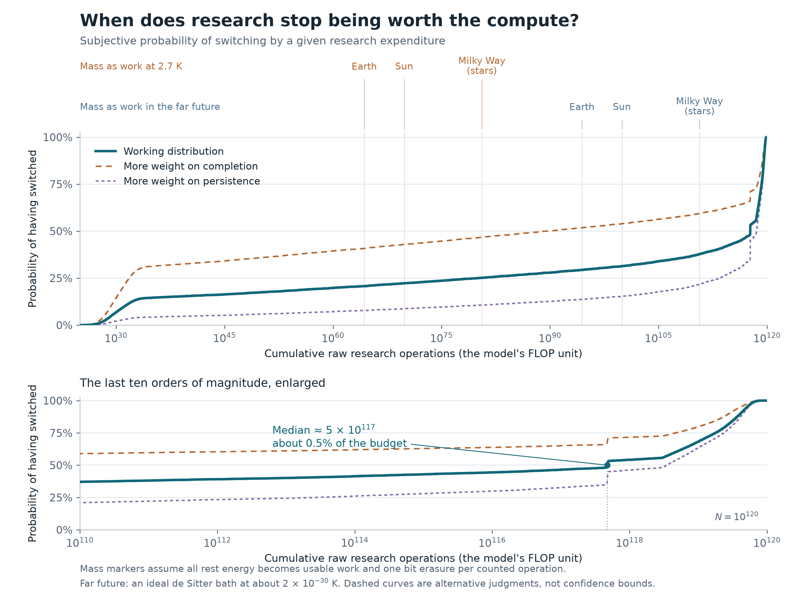

# The foom-coom transition

When should a being stop improving its ability to compute and start using its remaining compute for what it values? This project studies that allocation problem in a single-player toy world, with a common efficiency multiplier for research and cooming.

Start with the **[report](report.md)** or **[PDF](report.pdf)**. The report has a short main discussion, a probability plot, and technical appendices. It includes the final editorial revisions to the opening and footnotes. Research evidence is frozen through **2 October 2026**; this package was published on **8 October 2026**.



The stopping condition is $d\ln a/dx=1/(N-x)$ at a smooth interior optimum. Conditional on the stipulated budget $N=10^{120}$, the working subjective distribution has a median of roughly $5\times10^{117}$ research FLOPs. Its enormous spread is driven by judgments about the persistence of the hardest improvements. The probabilities are a mixture of possible laws, not an empirical confidence interval or a solved adaptive policy. Earth, Sun and Milky Way markers are conditional bit-erasure-equivalent resource budgets; their temperature and conversion assumptions are explicit in Appendix H.

## Contents

| Path | Purpose |
|---|---|
| `report.md`, `report.pdf` | Current standalone report, with public citations and appendices A–H |
| `foom-coom-distribution.png`, `.svg` | Current figure, including a zoom near the cosmic budget |
| `research_oct2026/synthesis/` | Current prior, 24,576 saved scenario evaluations, sensitivities, independent numerical audit and plot generation |
| `research_oct2026/empirical/` | Controlled pretraining, NanoGPT records and METR agent-expenditure fits, with frozen inputs and source audits |
| `research_oct2026/theory/` | Tail mechanisms, identification limits and review of the scenario assumptions |
| `research_oct2026/takeoff/` | AI 2027, AI Futures and Forethought replications and translations into the toy model |
| `calibration_revision/` | Research-compute accounting, human-compute comparison and historical calibration sensitivities |
| `forecast_revision/` | Exact recursive-improvement solvers and earlier forecast calculations used by later analyses |
| `empirical_methods/` | Earlier empirical fits and comparisons across efficiency datasets |
| `scripts/` | Portable math rendering and PDF build scripts |

The earlier forecast and calibration directories preserve intermediate scientific results. Their old scenario weights and summary reports are **not** the current forecast; use `research_oct2026/synthesis/prior.json`, its results, and the root report for that.

## Reproduce

From this project directory, use Python 3.13 and install the frozen scientific dependencies:

```sh
python3 -m venv .venv
. .venv/bin/activate
python -m pip install -r requirements.txt
```

The saved draws are sufficient to audit the current mixture and regenerate the figure without re-running the full forecast:

```sh
python research_oct2026/synthesis/audit_synthesis.py
python research_oct2026/synthesis/plot_forecast_cosmic.py
```

To regenerate the forecast and its additional sensitivities:

```sh
python research_oct2026/synthesis/forecast.py
python research_oct2026/synthesis/taper_model.py
python research_oct2026/synthesis/extra_sensitivities.py
python research_oct2026/synthesis/audit_synthesis.py
python research_oct2026/synthesis/plot_forecast_cosmic.py
```

The frozen forecast duplicates some prior parameters as Python constants; editing `prior.json` alone does not change every parameter. The independent audit checks agreement for this release. The three rapid-completion subfamilies share their parent weight equally; the plot does not equal-weight all rows.

To reproduce the current empirical fits and the research-compute normalization:

```sh
python research_oct2026/empirical/reproduce_all.py
python calibration_revision/compute_calibration.py
```

These calculations use included public source snapshots and need no network, paid API, or model inference. Further commands and optional upstream dependencies are in each directory's reproduction notes. In particular, re-running the current AI Futures model requires the pinned upstream checkout documented in `research_oct2026/takeoff/REPRODUCE.md`; its complete third-party repository is not vendored here.

To rebuild the report after editing its Markdown:

```sh
python scripts/render_math.py
python scripts/build_report.py
```

The builder reads `report.md` and the root figure. It supports the report's equations, tables, links, footnotes and explicit page breaks. Generated math assets and manifests go under ignored `tmp/`. The checked-in PDF is the reviewed publication artifact.

## Provenance and working files

The analysis and code were developed by Kaarel Hänni with GPT-6 (Codex). Source URLs, retrieval dates, hashes, selection rules and limitations accompany the empirical packages and the report. Source snapshots retain their original authorship and licensing; their inclusion does not imply a new license. Numerical reproducibility checks verify calculations conditional on the laws, not the distant extrapolations themselves. [PUBLICATION.md](PUBLICATION.md) records the checks on this copy.

Working branch: `codex/foom-coom-transition-2026-10-08`. Only the curated project is published to `main`. Local environments, caches, build intermediates, document-review images, orchestration records, raw article downloads and full third-party checkouts are excluded. Historical private-destination document builders are also omitted. No other project is changed.
