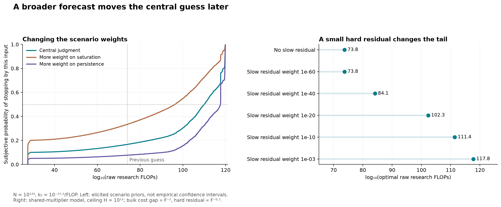

GPT-6 (Codex) — 2026-09-13

# A revised all-things-considered fooming forecast

Companion to [[will fooming be done?]] and [[Empirical stopping estimates — multiple methods]].

**My revised single-number guess is approximately $10^{110}$ raw FLOPs spent fooming.** This is a subjective median forecast of the realized optimal transition, conditional on the toy model. I would withdraw $10^{74}$ as my central estimate: it came from privileging one particular convergence exponent, rather than from adequately considering competing mechanisms.

The numerical scenario mixture below gives a median near $10^{110}$. Its interquartile range is roughly $10^{95}$–$10^{118}$; its central 80% range runs from about $10^{29}$ to half the budget. These are elicited judgments propagated through equations, **not an empirical posterior or calibrated confidence interval**. I regard the update toward later stopping as better supported than any particular exponent in the new point estimate.

## What is held fixed

Retain exactly the requested framework: raw budget $N=10^{120}$; initial marginal proportional gain $k_0=10^{-27.5}$ per FLOP; research and consumption receive the same efficiency multiplier; only effective cooming matters. Normalize today's multiplier to one and write it $a$. If $F$ is accumulated effective research and $x$ accumulated raw research, then

$$\frac{dF}{dx}=a(F),\qquad U(x)=a(F(x))(N-x).$$

For each possible deterministic improvement law I compute its optimal stopping point, rather than averaging fitted curve parameters. The marginal condition is

$$k(x)=\frac{d\ln a}{dx}=\frac1{N-x}.$$

The exact $k=10^{-120}$ crossing is also saved separately. It agrees closely with the optimum for subcosmic stops, but is different when much of the budget is spent. No change in the physical budget or today's gain calibration drives this revision.

## Why the earlier central estimate was too early

**A finite ceiling is plausible, but does not follow from the toy model.** The physical bound on raw operations is already represented by $N$. It does not additionally give a bound on an unspecified quality-adjusted-thought unit. Lower bounds on the execution cost of a fixed task can imply a task-specific efficiency ceiling, but that does not establish one universal ceiling for arbitrary increasingly difficult thought. Our recent literature review also found that measured algorithmic gains can depend strongly on model scale and reference algorithm. [Experimental study](https://arxiv.org/html/2511.21622v1).

**The inverse-first-power convergence law was a special choice.** A theory of interacting design improvements gives a cost-gap exponent $p=1/(\gamma d^*)$, where the density of candidate improvements and interactions between components matter. Its simplest independent-component case can give $p=1$, but interacting examples give smaller exponents. Conversely, adaptive optimization on sufficiently structured objectives can converge geometrically. These results establish competing mechanisms rather than identifying a universal exponent. [Design-complexity model](https://arxiv.org/abs/0907.0036), [adaptive optimization analysis](https://arxiv.org/abs/1111.0194).

**At the requested threshold, tiny difficult residuals matter.** A sum of power-law cost gaps is eventually dominated by its slowest nonzero component. This is a mathematical property of the model, not an empirical discovery about AI. It means that the improvements dominating today's measurements need not be the improvements governing the final transition.

## An exact family that preserves the common multiplier

Use inverse efficiency $C=1/a$, and let $H$ be the final efficiency relative to today, $f=1/H$:

$$C(F)=f+(1-f)(1+F/F_0)^{-p},\qquad F_0=\frac{p(1-f)}{k_0}.$$

The definition of $F_0$ ensures exactly the same initial marginal gain in every scenario. When saturation is far enough advanced and $x_*\ll N$, the resulting stopping scale is

$$\log_{10}x_*\approx\frac{120+27.5p+(1-p)\log_{10}H}{1+p}+\log_{10}[p(1-H^{-1})].$$

At precisely $p=1$, the dependence on the unknown ceiling height almost disappears and the expression reduces to $10^{73.75}$. For other exponents, headroom matters. The computations below use the exact equations even when this approximation fails.

At $H=10^{12}$, the exact results are:
| Cost-gap exponent p | log10 optimal FLOPs | Optimal FLOPs |
|---|---|---|
| 1 | 73.75 | 5.62 × 10^73 |
| 0.5 | 92.87 | 7.34 × 10^92 |
| 0.25 | 108.10 | 1.25 × 10^108 |
| 0.1 | 118.99 | 9.82 × 10^118 |

Now keep almost all of the $p=1$ cost gap and add a small $p=0.1$ component, still keeping the same ceiling and initial marginal gain:
| Slow component fraction of current reducible cost | log10 optimal FLOPs |
|---|---|
| 0 | 73.75 |
| 1e-60 | 73.75 |
| 1e-40 | 84.14 |
| 1e-20 | 102.32 |
| 1e-10 | 111.41 |
| 1e-03 | 117.75 |

For example, a slow component of weight $10^{-20}$ moves stopping to about $10^{102}$ FLOPs. Weight $10^{-3}$ moves it to about $6\times10^{117}$. The early histories can be nearly indistinguishable. One dominant $1/F$ curve therefore has not earned the central role I previously assigned it.

A continuous hierarchy of exponents provides another informative case:

$$C(F)=f+(1-f)\int_0^1(1+F/F_0)^{-p}\,dp.$$

This is a stylized assumption of residual difficulties extending toward arbitrarily small exponents. It has a finite ceiling but reaches an optimal raw research fraction of about **0.00468**, or $4.68\times10^{117}$ FLOPs, at $H=10^{12}$. Efficiency at the optimum is only about 214 times today's value, far below that ceiling. A ceiling that is never closely approached has little practical relevance to stopping.

I also retained an exponential cost-gap model representing rapid refinement or discrete exhaustion. Under the same universal feedback it can stop around $10^{27.5}$–$10^{29}$ FLOPs. Thus the slower-tail argument moves probability later; it does not rule out an early finish.

## The subjective forecast I actually used

I specified [the prior](forecast_prior.json) before calculating its stopping quantiles. I did not use the number of empirical fits as evidence weights, nor turn a published parameter confidence interval into a confidence interval about the cosmic tail.

The following weights express my judgment. Heterogeneous residuals get more weight than a single exponent because broadly useful thinking efficiency plausibly depends on multiple improvable mechanisms. Rapid convergence retains meaningful weight because intelligent search can outperform blind search. The very slow and effectively scale-free cases represent opportunities whose late constraints are never reached within the available budget.
| Scenario family | Subjective weight | Within-family median log10 stop |
|---|---|---|
| One finite-ceiling power gap | 25% | 90.9 |
| Fast bulk gains plus a hard residual | 35% | 108.8 |
| Rapid convergence to a ceiling | 10% | 27.5 |
| Hierarchy of increasingly hard residuals | 10% | 117.7 |
| Effectively scale-free over available budget | 20% | 119.7 |

For finite-ceiling families, the primary headroom prior is uniform in $\log_{10}H$ from 1 to 12. There is no empirical or physical result establishing this range. I vary it explicitly below. The single-gap exponent has a lognormal prior centered at $p=0.5$, with a factor-three standard deviation in log space. The hard-residual family uses bulk exponents between 0.5 and 2, hard exponents between 0.03 and 0.3, and residual amplitudes between $10^{-12}$ and $10^{-2}$, each log-uniform. These numerical choices are subjective. They expose rather than resolve the missing knowledge.

The effectively scale-free family's raw-input power exponent has lognormal median 1 and log-standard-deviation 0.5. This is roughly consistent with the finite-range empirical scenarios, but should not be read as a fitted parameter posterior. The family can also represent a finite ceiling that is irrelevant during this budget, rather than literally infinite physical efficiency.

The resulting cumulative probabilities, rounded to avoid suggesting unjustified precision, are:
| Stop by this many raw FLOPs | Subjective cumulative probability |
|---|---|
| 10^30 | 10% |
| 10^74 | 17% |
| 10^100 | 30% |
| 10^110 | 50% |
| 10^118 | 77% |
| 10^119 | 80% |

The median is $10^{110.02}$ FLOPs, which I round to **$10^{110}$**. There is about **23%** weight on spending at least 1% of the entire budget and **20%** on spending at least 10%. Under this prior, the old $10^{74}$ guess lies around the 17th percentile. These probabilities depend on the stated judgments.

The ordinary expected research input is about $0.10N$, because late worlds dominate an arithmetic mean. The mean of log input is near $10^{98}$ after exponentiating. Neither is the median, and neither automatically gives the optimal action under uncertainty. I use the median as the main single-number forecast because the question concerns the transition likely to occur in the realized world.

## Sensitivity is part of the answer

Holding the primary headroom prior fixed, the alternatives below change only scenario weights. Their exact weights are in the prior file.
| Weighting | Median log10 stop |
|---|---|
| central | 110.0 |
| more_saturation | 96.2 |
| more_persistence | 117.5 |
| no_heterogeneity | 100.8 |

Keeping the central weights but changing the headroom prior also moves the result:
| Uniform log10 headroom range | Median log10 stop |
|---|---|
| 1–3 | 106.4 |
| 1–12 | 110.0 |
| 1–30 | 116.4 |
| 1–120 | 118.7 |

The better-grounded conclusion is that the previous $10^{74}$ central estimate understated the importance of slow refinements and uncertain headroom. The evidence does not determine that the new median must be $10^{110}$ rather than $10^{100}$ or $10^{118}$. My point estimate is a transparent synthesis of uncertain mechanisms, with the sensitivity displayed rather than hidden in one selected tail law.

## Maximizing expected cooming is a different calculation

The forecast above concerns each possible world's optimal transition, assuming its improvement law becomes sufficiently understood. It is not a fixed allocation to commit to now. Under uncertainty, a fixed commitment maximizes

$$\mathbb E[U(x)]=(N-x)\mathbb E[a(x)],$$

so its marginal condition uses the efficiency-weighted expectation $\mathbb E[ak]/\mathbb E[a]$. A mean or median of individual stopping points is not the decision rule.

An explicit two-world example makes the difference large. Give one world a ceiling $10^6$ and another the raw law $a=1+k_0x$. If the agent could never learn which world it occupied, a probability of only about $3\times10^{-87}$ on the second world could justify macroscopic late research, because its possible multiplier is enormously larger. But these particular laws become distinguishable near $10^{27.5}$ raw FLOPs. An adaptive agent can learn the difference and stop early in the ceiling world; the tiny high-payoff branch does not imply that most realized worlds research until near $N$.

This distinction prevents a misleading claim that my median is itself the action maximizing all-things-considered expected utility. A quantitatively optimal adaptive policy additionally requires an observation and learning model that the empirical data do not supply. [Full two-world calculation](DECISION.md).

## Evidence, verification and remaining limits

The existing empirical fits mainly constrain current rates and behavior across a limited historical range. They do not measure universal efficiency headroom, the smallest future bottleneck exponent, or the rate at which new research paradigms remove old bottlenecks. The current revision uses those studies to constrain the interpretation of the forecast, rather than manufacturing a likelihood for those unobserved quantities. [Earlier empirical comparison](../empirical_methods/REPORT.md).

Complexity results do not settle these missing quantities either. Hutter's near-fastest-program result requires provable correctness and time bounds and can have enormous proof-dependent overhead; it is not a useful bound on the raw FLOPs required to optimize universal thought. [Original theorem and qualifications](https://hutter1.net/ai/pfastprg.pdf).

The mathematical implementation verifies the initial calibration, raw/effective conversion, numerical derivatives and exact stopping roots. The continuum model is independently checked by positive-integrand quadrature. Log-convexity of cost proves that the economic root is the unique global maximum for the selected finite-ceiling families. The mixture uses 1,024 scrambled Sobol draws per family and common draws across headroom sensitivities; numerical sampling precision is much less important than the subjective assumptions.

No additional raw CPU-year source was fetched, and no new observational dataset was presented as evidence for the probability weights. The substantive new work is the recursive tail audit, the hidden-residual and continuum models, the explicit forecast distribution and prior sensitivity, and the distinction between forecasting and choosing a policy.

Reproducibility: [full results](forecast_results.json), [all scenario draws](forecast_draws.csv), [exact model mathematics](MATH.md), [tail evidence](tail_evidence.md), [ceiling assessment](CEILING.md), and [code and prior](REPRODUCE.md).
