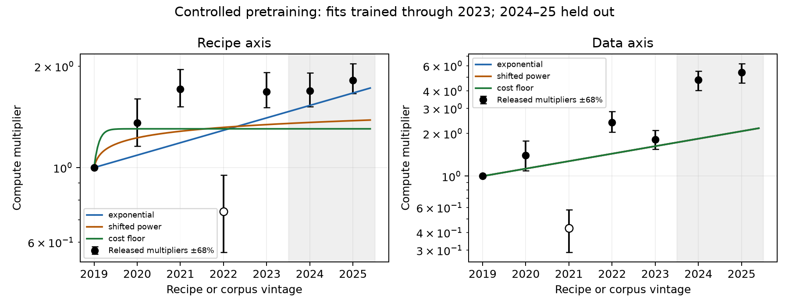
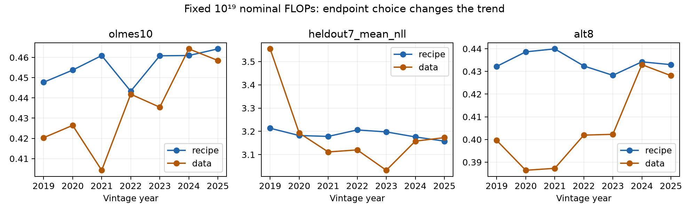

# Controlled pretraining vintages: new fits and a source audit

Research snapshot: 2 October 2026. This package independently fits the public numerical release underlying Patel and Han's controlled pretraining experiment. The earlier calibration cited the experiment's headline growth rate; it did not freeze these observations, compare curve shapes, examine the seed records, or test dependence on the evaluation metric. This is a stronger validation of an already-mentioned study, not a new independent study.

**The data do not provide a stable estimate of saturation.** With all seven vintages included, both axes push a fitted positive execution-cost floor to zero. Removing the authors' extrapolated GPT-NeoX multiplier makes a finite recipe ceiling fit well and predict the last two vintages better. The same intervention does not produce a data-axis ceiling. A universal ceiling inferred from this experiment would therefore depend on selection and metric choices the observations do not settle.

## Sources and what was frozen

Primary article: [Patel and Han, 8 September 2026](https://www.dwarkesh.com/p/pretraining-progress-is-mostly-data). Primary numerical release: [Jerry Han's checkpoint repository, immutable revision d92bd43970d5fb20a2c987025ae5892343bdb2db](https://huggingface.co/j23h67/compute-multipliers-checkpoints/tree/d92bd43970d5fb20a2c987025ae5892343bdb2db). The repository API records creation on 12 September and last modification on 13 September 2026. These are release dates; **2019–2025 are assigned algorithm/corpus vintages, not the dates when these measurements were performed**.

The frozen release contains a 50-row checkpoint CSV, all 50 small `run.json` records, the author audit log, the model card, and hashes/immutable URLs in `sources/manifest.json`. No model weights were downloaded. `multipliers.csv` is extracted reproducibly from the model card's seven-row table; it is not constructed from a reported doubling time or digitized picture. The low/high columns are the authors' printed 68% intervals.

The linked full campaign repository, [Lunar-Society/compute-multipliers](https://github.com/Lunar-Society/compute-multipliers), returned 404 through both the website and API. The Datawrapper pages failed through direct download, and their CSV endpoints were inaccessible through web retrieval. Consequently this is **not** a replication of the full 1,397-run training campaign, the compute-optimal size selection, or the interpolation/bootstrap that produced the multipliers. The full crossing pipeline is unavailable here. Failed accesses are retained in `sources/retrieval_failures.json`.

There is an unresolved primary-source discrepancy:

| 2019→2025 efficiency comparison | September article | Frozen checkpoint card |
|---|---:|---:|
| Recipe axis | 3.7× | 1.82× |
| Corpus axis | 12.0× | 5.39× |
| Joint annual factor | 1.57× | 1.57× |

We use the release's explicit per-vintage table for fitting and preserve both versions in `sources/source_conflicts.json`. We cannot establish whether the differences are corrections, different analysis settings, or documentation drift. The release also describes its joint 15.1× gain as below the product of the printed marginal gains, although 1.82×5.39=9.8098. That sentence is arithmetically inconsistent. Gains conditional on different baselines need not multiply; neither version licenses a joint multiplier calculated by multiplying its separate axes.

## Experimental controls and limitations

The recipe axis varies seven selected recipes while holding FineWeb-Edu fixed. The data axis varies seven selected corpora while holding OLMo 2 fixed. The checkpoint slice holds nominal compute at 10^19, with a common tokenizer, context, and token batch. Model size is chosen by the experiment's native-loss procedure. Thus hardware price changes and simple increases in nominal training budget cannot explain the observed vintage effects.

These are author-selected representatives, not an exhaustive annual performance frontier. Modern learning-rate calibration and common protocol choices are imposed across vintages. The last two vintages are a useful ordered holdout, but this is a **retrospective vintage holdout**, not a prospective prediction made in 2023. The small models, common tokenizer/context and downstream evaluation omit much of the progress important at frontier scale. The experiment's training compute is the cost of evaluating a recipe; it is not the global research input spent discovering that recipe.

The recipe multiplier's reference is GPT-2 on FineWeb-Edu; the corpus multiplier's reference is OpenWebText under OLMo 2. They are different conditionals. A regression over both as if they were independent observations of a single universal trend would be unjustified.

## Units and dependence audit

`analyze.py` checks every source hash and joins each checkpoint to its run record. The CSV has 50 distinct run IDs in 15 recipe/corpus cells, but only **45 distinct cell/seed combinations**. Every cell has three distinct seed labels. Extra rows reuse seed labels for pack-size variants, so the raw row count is not the number of independent seeds.

For metric validation, repeats are averaged within a cell/seed and then the three seed values receive equal weight. This changes a cell mean by at most 0.00157 in OLMES score, 0.00972 nats in mixed-corpus NLL, and 0.000828 in the alternative score. Source row means remain recoverable from the original CSV. Source rows are not silently deleted.

For all 50 records, 6ND recomputed from the CSV agrees with the run's nominal FLOP field. Actual nominal budgets differ from 10^19 only by 0.0010–0.0051%, consistent with token-batch discretization. The calculation uses floating-point conversion **before multiplication** because 6ND exceeds signed 64-bit integer capacity.

The run records' separate `flops_exact`/`flops_6nd` ratio ranges from **1.166 to 1.589**. Hence a fixed nominal budget is not a fixed value under even the source's fuller arithmetic accounting. We retain both in `results/unit_audit.csv`; we do not assert that the source's “exact” formula is a hardware-measured physical FLOP count. The recipe-specific overhead differs, so one must not reinterpret nominal multipliers as exact physical multipliers without rerunning the scaling curves with consistent accounting.

All records retain `reportable:false` and a pilot-stage label. The public card explicitly explains those as retired launch-path labels, and identifies the rows as production measurements. We preserve and disclose the flags rather than silently filtering all observations or changing their labels. The author-provided model-loading audit is source evidence, not a model rerun performed by this analysis.

## Curve equations and estimation

Let t=vintage−2019 and let m(t) be the printed fixed-performance compute multiplier. The reference m(0)=1 is exact by definition. We minimize unweighted squared error in y=ln(m), anchoring y(0)=0:

1. No trend: y=0.
2. Exponential calendar/vintage progress: y=s t, s≥0.
3. Shifted power in vintage time: y=p ln(1+t/τ), p≥0, 0.05≤τ≤100,000 years.
4. Positive execution-cost floor: y=−ln[f+(1−f)exp(−s t)], s≥0, 0≤f<1. The implied ceiling is 1/f; f=0 is the non-saturating limit.

These are **functions of vintage time**, not raw or effective research FLOPs. The shifted-power parameter p here is not the report's effective-research residual-gap exponent.

Nonlinear fits use multiple starts. Parameters at limiting values are flagged. We fit all seven vintages, then separately fit through 2023 and score 2024–2025 predictions using RMSE in log multiplier. A sensitivity excludes only the two table entries the authors flag as crossings beyond the measured compute range: NeoX on the recipe axis and the Pile on the data axis. Those points remain in the primary analysis; their poor values are not treated as transcription errors.

The log intervals of the derived ratios are asymmetric and share reference curves. We do not use their printed marginal intervals as if they gave an independent error likelihood. AICc is included only as a descriptive penalized fit statistic using six nonreference residuals (five in the exclusion sensitivity), with K equal to the number of mean-curve parameters plus one fitted residual-variance parameter. It is not a Bayes factor. In the recipe exclusion subset it favors exponential progress despite the floor's lower holdout error, underlining that different small-sample criteria need not agree. `floor_profiles.csv` records the residual profile over f, without attaching a likelihood-ratio confidence interval. We do not count the 16 correlated fits as separate studies.

## Multiplier-fit results

| Axis and selection | Exponential log gain/vintage-year | Annual factor | Holdout RMSE: exponential | Shifted power | Cost floor |
|---|---:|---:|---:|---:|---:|
| Recipe, all | 0.0964 | 1.101 | 0.0940 | 0.2485 | 0.2987 |
| Recipe, omit extrapolated NeoX crossing | 0.1180 | 1.125 | 0.3462 | 0.0492 | 0.0378 |
| Corpus, all | 0.2372 | 1.268 | 0.9567 | 0.9567 | 0.9567 |
| Corpus, omit extrapolated Pile crossing | 0.2675 | 1.307 | 0.4986 | 0.7916 | 0.8778 |

The all-observation full-sample floors run to f≈0 on both axes; shifted-power fits likewise run to the large-τ exponential limit. On the recipe axis, omitting NeoX yields a full-sample floor f=0.571 (ceiling ≈1.75×), and its two-vintage holdout error is smallest. That fitted ceiling is slightly below the observed 2025 point estimate of 1.82; it is an average-error fit, not a hard empirical bound.

For the corpus axis, the early fit substantially underpredicts improvements from the 2024–2025 corpora. Even after removing the extrapolated Pile crossing, a saturating forecast performs worse than the exponential alternative. The data provide neither a stable positive floor nor a stable universal annual factor. The recipe's apparent saturation and the corpus's later gains can coexist.



## Validation against raw checkpoint endpoints

We additionally fit equal-vintage linear trends to three endpoints at the fixed nominal compute budget, and compare a linear extrapolation fitted through 2023 against holding the 2023 value constant. These are score/loss regressions, **not** independent efficiency multipliers. Only mixed-corpus `heldout7_mean_nll` is compared across corpora; native corpus loss is not a common ruler.

For uncertainty we enumerate all 3^3=27 bootstrap resamples of the three seed labels, keeping each sampled label together across vintages. Repeated pack-size runs are averaged first. The resulting 5th–95th percentiles are conditional seed sensitivities. Three clusters are too few for reliable population confidence coverage, and this procedure excludes task selection, corpus selection, learning-rate calibration, and benchmark uncertainty.

| Axis; metric | 2025−2019 change | Conditional 90% seed range | 2025−2023 change |
|---|---:|---:|---:|
| Recipe; OLMES fraction | +0.01650 | +0.01169 to +0.02131 | +0.00342 |
| Recipe; mixed-corpus NLL, lower better | −0.05539 nats | −0.05832 to −0.05246 | −0.03971 |
| Recipe; alternative score fraction | +0.00077 | −0.00126 to +0.00279 | +0.00471 |
| Corpus; OLMES fraction | +0.03818 | +0.03251 to +0.04386 | +0.02310 |
| Corpus; mixed-corpus NLL, lower better | −0.38155 nats | −0.41261 to −0.35050 | **+0.14033, worse** |
| Corpus; alternative score fraction | +0.02855 | +0.02377 to +0.03333 | +0.02587 |

The recipe endpoint gain is negligible on the alternative task suite, despite improving the other measures. For the corpus axis, 2025 improves OLMES relative to 2023 while worsening mixed-domain NLL. Predicting 2024–2025 NLL using the earlier linear corpus trend has RMSE 0.3595 nats, versus 0.1330 for holding the 2023 value. This failed prediction matters: a “better data” trend is benchmark dependent, even within one controlled experiment.



## Consequences for the foom–coom forecast

1. This evidence strengthens the case for heterogeneous, target-dependent opportunities. Some local curves can look nearly saturated while another component improves, and a different evaluation metric can reverse the recent trend. It does not estimate the weights of a cosmic-tail mixture.
2. A fitted floor for one recipe family at one nominal training scale is not a bound on general reasoning efficiency. No human-brain comparison enters this analysis, and no small universal headroom is inferred.
3. The joint headline rate 1.57×/year remains consistent between the source versions, but the released numerical marginals differ materially from the article. The forecast should cite the source version and retain this unresolved discrepancy. Our independently fitted marginal rates are not substitutes for the joint rate or for industry-wide k0.
4. To turn vintage progress into the model's k(x), one would need the research input used to discover the recipes/data changes and a justified transfer to the common multiplier. Those are unobserved. Under dF/dx=a, k=d ln(a)/dx=da/dF; simply labeling vintage years “effective FLOPs,” or applying an extra recursive multiplier to already-raw inputs, would be incorrect.
5. At k0≈10^-29 and N=10^120, the stopping rule asks about approximately 91 orders of marginal-return decline. These six vintage intervals do not identify that tail. This package therefore returns no new numerical cosmic stopping distribution and does not mechanically update the former 10^110 median.

## Reproduction

Use Python with NumPy, pandas, SciPy and Matplotlib. From the project root:

```sh
PYTHONDONTWRITEBYTECODE=1 python research_oct2026/empirical/pretraining/analyze.py
```

The frozen data suffice; no network is used by `analyze.py`. For a fresh environment, install the versions in the parent `requirements.txt`. `fetch_sources.py` optionally downloads only the immutable metadata URLs in the manifest and refuses a hash mismatch. Outputs are regenerated under `results/`; source hashes are checked before fitting. All code/data in this package stay inside the assigned empirical research folder.
